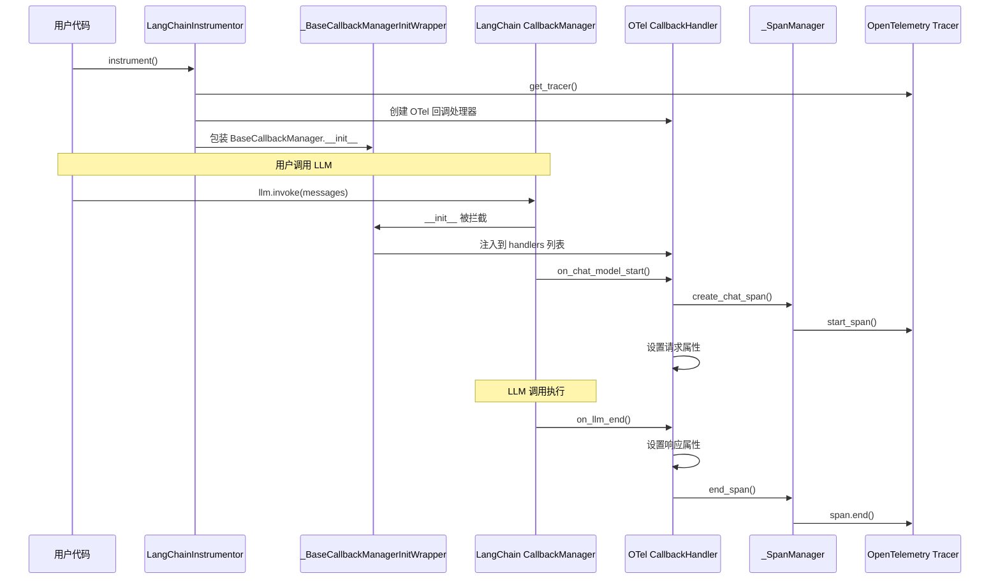

# OpenTelemetry LangChain Instrumentation 包分析

## 1. 包概述

### 1.1 基本信息
- **包名**: `opentelemetry-instrumentation-langchain`
- **版本状态**: Beta (开发状态: 4 - Beta)
- **Python 版本要求**: >= 3.9
- **许可证**: Apache-2.0
- **维护者**: OpenTelemetry Authors

### 1.2 包的核心作用
这是一个 OpenTelemetry 官方提供的 LangChain 框架自动化监控插桩（instrumentation）包，用于为 LangChain 应用程序自动添加分布式追踪（tracing）能力，捕获大语言模型（LLM）调用的遥测数据。

## 2. 主要功能

### 2.1 支持的 LLM 提供商
目前支持以下 LLM 提供商：
- **ChatOpenAI** - OpenAI 的聊天模型（如 GPT-3.5-turbo, GPT-4 等）
- **ChatBedrock** - AWS Bedrock 的聊天模型（如 Amazon Nova 系列）

> **注意**: 其他提供商/LLM 可能在未来得到支持，目前对它们的遥测数据会被跳过。

### 2.2 捕获的遥测数据
该包能够捕获以下关键信息：

#### 请求参数
- `gen_ai.request.model` - 请求的模型名称
- `gen_ai.request.temperature` - 温度参数
- `gen_ai.request.max_tokens` - 最大 token 数
- `gen_ai.request.top_p` - Top-P 采样参数
- `gen_ai.request.frequency_penalty` - 频率惩罚
- `gen_ai.request.presence_penalty` - 存在惩罚
- `gen_ai.request.stop_sequences` - 停止序列
- `gen_ai.request.seed` - 随机种子

#### 响应信息
- `gen_ai.response.model` - 实际使用的模型名称
- `gen_ai.response.id` - 响应 ID
- `gen_ai.response.finish_reasons` - 完成原因列表
- `gen_ai.usage.input_tokens` - 输入 token 数量
- `gen_ai.usage.output_tokens` - 输出 token 数量

#### 其他属性
- `gen_ai.operation.name` - 操作名称（如 "chat"）
- `gen_ai.provider.name` - 提供商名称（如 "openai", "amazon_bedrock"）
- `error.type` - 错误类型（发生错误时）

## 3. 核心架构

### 3.1 架构组件

```
┌─────────────────────────────────────────────────────────────┐
│                   LangChainInstrumentor                      │
│  (主入口类，继承自 BaseInstrumentor)                          │
└────────────────────┬────────────────────────────────────────┘
                     │
                     │ 创建并注入
                     ▼
┌─────────────────────────────────────────────────────────────┐
│        OpenTelemetryLangChainCallbackHandler                │
│  (自定义回调处理器，继承自 BaseCallbackHandler)               │
└────────────────────┬────────────────────────────────────────┘
                     │
                     │ 使用
                     ▼
┌─────────────────────────────────────────────────────────────┐
│                    _SpanManager                              │
│  (Span 生命周期管理器)                                        │
└─────────────────────────────────────────────────────────────┘
```

### 3.2 核心类详解

#### 3.2.1 LangChainInstrumentor
**文件**: `__init__.py`

**职责**:
- 作为插桩的主入口点
- 实现 `_instrument()` 和 `_uninstrument()` 方法
- 通过 `wrapt` 库包装 LangChain 的 `BaseCallbackManager.__init__` 方法
- 自动将 OpenTelemetry 回调处理器注入到 LangChain 的回调管理器中

**关键方法**:
```python
def _instrument(self, **kwargs):
    # 创建 tracer
    tracer = get_tracer(__name__, __version__, tracer_provider, ...)
    
    # 创建 OTel 回调处理器
    otel_callback_handler = OpenTelemetryLangChainCallbackHandler(tracer=tracer)
    
    # 包装 BaseCallbackManager.__init__
    wrap_function_wrapper(
        module="langchain_core.callbacks",
        name="BaseCallbackManager.__init__",
        wrapper=_BaseCallbackManagerInitWrapper(otel_callback_handler),
    )

def _uninstrument(self, **kwargs):
    # 移除包装
    unwrap("langchain_core.callbacks.base.BaseCallbackManager", "__init__")
```

#### 3.2.2 _BaseCallbackManagerInitWrapper
**职责**:
- 包装器类，用于拦截 `BaseCallbackManager` 的初始化
- 确保 OpenTelemetry 回调处理器被添加到管理器的处理器列表中
- 避免重复添加相同类型的处理器

**工作原理**:
```python
def __call__(self, wrapped, instance, args, kwargs):
    wrapped(*args, **kwargs)  # 调用原始 __init__
    
    # 检查是否已存在 OTel 处理器
    for handler in instance.inheritable_handlers:
        if isinstance(handler, type(self._otel_handler)):
            break
    else:
        # 不存在则添加
        instance.add_handler(self._otel_handler, inherit=True)
```

#### 3.2.3 OpenTelemetryLangChainCallbackHandler
**文件**: `callback_handler.py`

**职责**:
- 实现 LangChain 的 `BaseCallbackHandler` 接口
- 监听 LLM 调用的生命周期事件
- 将事件转换为 OpenTelemetry span 和属性

**关键回调方法**:

1. **on_chat_model_start**: LLM 调用开始时触发
   - 检查模型类型（仅支持 ChatOpenAI 和 ChatBedrock）
   - 提取请求参数（model, temperature, max_tokens 等）
   - 创建 span 并设置请求属性

2. **on_llm_end**: LLM 调用成功结束时触发
   - 提取响应信息（finish_reasons, token 使用量等）
   - 设置响应属性
   - 结束 span

3. **on_llm_error**: LLM 调用出错时触发
   - 设置 span 状态为 ERROR
   - 记录错误类型
   - 结束 span

#### 3.2.4 _SpanManager
**文件**: `span_manager.py`

**职责**:
- 管理 span 的生命周期
- 维护 span 的父子关系
- 处理嵌套调用场景

**核心数据结构**:
```python
@dataclass
class _SpanState:
    span: Span
    children: List[UUID] = field(default_factory=lambda: list())

class _SpanManager:
    spans: Dict[UUID, _SpanState] = {}  # run_id -> _SpanState 映射
```

**关键方法**:
- `create_chat_span()`: 创建聊天操作的 span
- `end_span()`: 结束 span 及其所有子 span
- `get_span()`: 根据 run_id 获取 span
- `handle_error()`: 处理错误情况

**父子关系处理**:
```python
def _create_span(self, run_id, parent_run_id, span_name, kind):
    if parent_run_id is not None and parent_run_id in self.spans:
        # 有父 span，创建子 span
        parent_state = self.spans[parent_run_id]
        parent_span = parent_state.span
        ctx = set_span_in_context(parent_span)
        span = self._tracer.start_span(name=span_name, kind=kind, context=ctx)
        parent_state.children.append(run_id)
    else:
        # 顶层 span
        span = self._tracer.start_span(name=span_name, kind=kind)
```

## 4. 工作原理

### 4.1 插桩流程



### 4.2 Span 命名规范
Span 名称格式: `{operation_name} {model_name}`

示例:
- `chat gpt-3.5-turbo`
- `chat us.amazon.nova-lite-v1:0`

### 4.3 Span 类型
- **SpanKind.CLIENT**: 用于 LLM 调用（表示客户端调用外部服务）

## 5. 使用方法

### 5.1 手动插桩（Manual Instrumentation）

```python
from opentelemetry.instrumentation.langchain import LangChainInstrumentor
from langchain_core.messages import HumanMessage, SystemMessage
from langchain_openai import ChatOpenAI

# 启用插桩
LangChainInstrumentor().instrument()

# 使用 LangChain
llm = ChatOpenAI(model="gpt-3.5-turbo", temperature=0, max_tokens=1000)
messages = [
    SystemMessage(content="You are a helpful assistant!"),
    HumanMessage(content="What is the capital of France?"),
]
result = llm.invoke(messages)

# 禁用插桩
LangChainInstrumentor().uninstrument()
```

### 5.2 零代码插桩（Zero-Code Instrumentation）

通过环境变量和命令行工具自动启用：

```bash
# 设置环境变量
export OTEL_PYTHON_LOGGING_AUTO_INSTRUMENTATION_ENABLED=true

# 使用 opentelemetry-instrument 命令
opentelemetry-instrument python your_app.py
```

### 5.3 配置 Tracer Provider

```python
from opentelemetry import trace
from opentelemetry.sdk.trace import TracerProvider
from opentelemetry.sdk.trace.export import BatchSpanProcessor
from opentelemetry.exporter.otlp.proto.grpc.trace_exporter import OTLPSpanExporter

# 配置追踪
trace.set_tracer_provider(TracerProvider())
span_processor = BatchSpanProcessor(OTLPSpanExporter())
trace.get_tracer_provider().add_span_processor(span_processor)

# 启用插桩
LangChainInstrumentor().instrument()
```

## 6. 依赖关系

### 6.1 核心依赖
```toml
dependencies = [
  "opentelemetry-api >= 1.31.0",
  "opentelemetry-instrumentation ~= 0.57b0",
  "opentelemetry-semantic-conventions ~= 0.57b0"
]
```

### 6.2 可选依赖（被插桩的包）
```toml
[project.optional-dependencies]
instruments = [
  "langchain >= 0.3.21",
]
```

## 7. 语义约定（Semantic Conventions）

该包遵循 OpenTelemetry 的语义约定版本: **V1_37_0**

使用的属性命名空间:
- `gen_ai.*` - 生成式 AI 相关属性
- `error.*` - 错误相关属性

## 8. 测试覆盖

### 8.1 测试场景
- ChatOpenAI (GPT-3.5-turbo) 调用测试
- ChatBedrock (Amazon Nova) 调用测试
- Gemini 模型测试（验证不支持的模型不会创建 span）
- Span 管理器单元测试

### 8.2 测试工具
- 使用 `pytest` 作为测试框架
- 使用 `vcrpy` 录制和回放 HTTP 请求
- 使用 `InMemorySpanExporter` 验证 span 数据

## 9. 项目结构

```
opentelemetry-instrumentation-langchain/
├── src/opentelemetry/instrumentation/langchain/
│   ├── __init__.py              # LangChainInstrumentor 主类
│   ├── callback_handler.py     # OpenTelemetry 回调处理器
│   ├── span_manager.py          # Span 生命周期管理
│   ├── package.py               # 依赖声明
│   └── version.py               # 版本信息
├── tests/
│   ├── conftest.py              # 测试配置和 fixtures
│   ├── test_llm_call.py         # LLM 调用测试
│   ├── test_span_manager.py    # Span 管理器测试
│   └── cassettes/               # VCR 录制的请求/响应
├── examples/
│   ├── manual/                  # 手动插桩示例
│   └── zero-code/               # 零代码插桩示例
├── pyproject.toml               # 项目配置
├── CHANGELOG.md                 # 变更日志
└── README.rst                   # 项目说明
```

## 10. 关键技术点

### 10.1 使用 wrapt 进行函数包装
- 使用 `wrap_function_wrapper` 拦截 LangChain 的回调管理器初始化
- 非侵入式地注入 OpenTelemetry 功能

### 10.2 回调机制
- 利用 LangChain 的回调系统捕获 LLM 生命周期事件
- 通过 `inheritable_handlers` 确保回调在整个调用链中传播

### 10.3 UUID 追踪
- LangChain 为每个运行分配唯一的 `run_id`
- 使用 `run_id` 和 `parent_run_id` 建立 span 的父子关系

### 10.4 条件插桩
- 仅对支持的模型类型创建 span
- 对不支持的模型静默跳过，不影响应用运行

## 11. 注意事项和限制

### 11.1 当前限制
1. **模型支持有限**: 仅支持 ChatOpenAI 和 ChatBedrock
2. **功能范围**: 目前仅支持聊天模型，未来可能扩展到 chains、tools 等
3. **内存管理**: Span 管理器使用字典存储 span 状态，长时间运行的进程可能存在内存泄漏风险（TODO #3735）

### 11.2 最佳实践
1. 在应用启动时调用 `instrument()`
2. 在应用关闭时调用 `uninstrument()` 清理资源
3. 配置合适的 span exporter 将数据发送到后端
4. 使用批处理 span processor 提高性能

## 12. 扩展性

### 12.1 添加新模型支持
要支持新的 LLM 提供商，需要：
1. 在 `on_chat_model_start` 中添加模型名称检查
2. 处理该模型特定的参数提取逻辑
3. 在 `on_llm_end` 中处理该模型的响应格式
4. 添加相应的测试用例

### 12.2 未来可能的扩展
- 支持更多 LLM 提供商（Anthropic, Cohere 等）
- 支持 LangChain chains 的追踪
- 支持 tools 和 agents 的追踪
- 添加更多自定义属性和事件

## 13. 总结

`opentelemetry-instrumentation-langchain` 是一个专门为 LangChain 框架设计的可观测性插桩包，它通过以下方式提供价值：

1. **自动化**: 无需修改应用代码即可获得追踪能力
2. **标准化**: 遵循 OpenTelemetry 标准，与生态系统兼容
3. **详细性**: 捕获丰富的 LLM 调用元数据
4. **非侵入**: 通过回调机制实现，不影响应用逻辑
5. **可扩展**: 架构清晰，易于添加新功能

该包特别适合需要监控和分析 LangChain 应用中 LLM 调用性能、成本和行为的场景。
