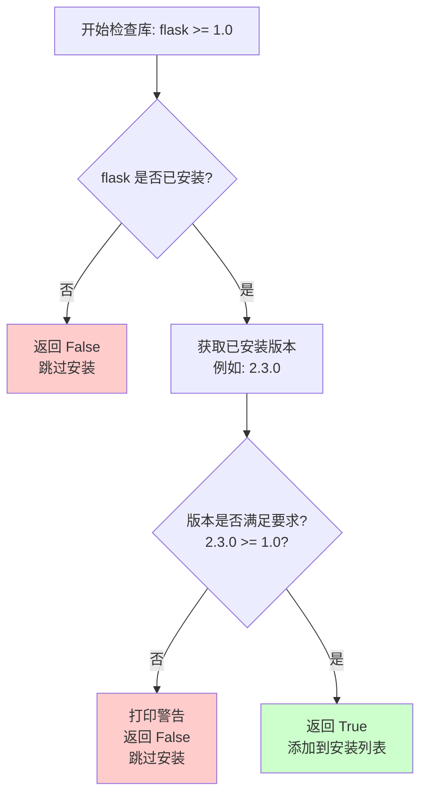
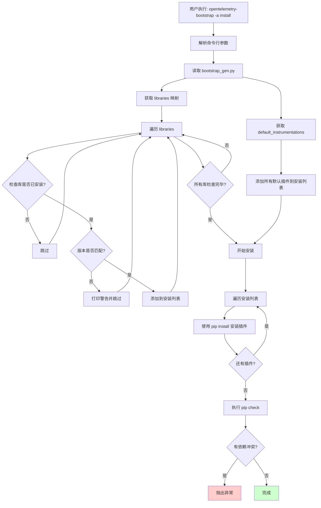

# OpenTelemetry Bootstrap 插件安装分析

> 深入分析 `opentelemetry-bootstrap -a install` 命令的工作原理、插件选择逻辑和安装流程

---

## 📋 目录

- [1. 命令概述](#1-命令概述)
- [2. 会下载哪些插件](#2-会下载哪些插件)
- [3. 判断逻辑详解](#3-判断逻辑详解)
- [4. 完整工作流程](#4-完整工作流程)
- [5. 实际案例分析](#5-实际案例分析)
- [6. 源码深度解析](#6-源码深度解析)

---

## 1. 命令概述

### 1.1 基本用法

```bash
# 列出需要安装的插件（不实际安装）
opentelemetry-bootstrap

# 或者
opentelemetry-bootstrap -a requirements

# 实际安装插件
opentelemetry-bootstrap -a install
```

### 1.2 命令作用

**核心功能**：自动检测系统中已安装的 Python 库，并安装对应的 OpenTelemetry instrumentation 包。

**优势**：
- ✅ 无需手动查找每个库对应的 instrumentation 包
- ✅ 自动检查版本兼容性
- ✅ 一键安装所有需要的插件
- ✅ 避免遗漏或安装错误的插件

---

## 2. 会下载哪些插件

### 2.1 插件分类

`opentelemetry-bootstrap -a install` 会安装 **两类** 插件：

#### 📦 类型 1：默认插件（Default Instrumentations）

**特点**：**无条件安装**，不需要检测任何库

**列表**（来自 `bootstrap_gen.py`）：
```python
default_instrumentations = [
    "opentelemetry-instrumentation-asyncio==0.61b0.dev",
    "opentelemetry-instrumentation-dbapi==0.61b0.dev",
    "opentelemetry-instrumentation-logging==0.61b0.dev",
    "opentelemetry-instrumentation-sqlite3==0.61b0.dev",
    "opentelemetry-instrumentation-threading==0.61b0.dev",
    "opentelemetry-instrumentation-urllib==0.61b0.dev",
    "opentelemetry-instrumentation-wsgi==0.61b0.dev",
]
```

**为什么无条件安装？**
- 这些是 Python 标准库或内置模块（如 asyncio、logging、threading、urllib、sqlite3）
- 不需要额外安装，系统中一定存在
- 提供基础的可观测性能力

---

#### 🔍 类型 2：条件插件（Conditional Instrumentations）

**特点**：**根据已安装的库动态决定**是否安装

**判断逻辑**：
1. 检查目标库是否已安装
2. 检查目标库的版本是否满足要求
3. 如果满足，则安装对应的 instrumentation 包

**完整列表**（来自 `bootstrap_gen.py`，共 **50+** 个库）：

| 目标库 | 版本要求 | Instrumentation 包 |
|--------|----------|-------------------|
| **Web 框架** |
| flask | >= 1.0 | opentelemetry-instrumentation-flask |
| django | >= 1.10 | opentelemetry-instrumentation-django |
| fastapi | ~= 0.92 | opentelemetry-instrumentation-fastapi |
| starlette | >= 0.13 | opentelemetry-instrumentation-starlette |
| tornado | >= 5.1.1 | opentelemetry-instrumentation-tornado |
| falcon | >= 1.4.1, < 5.0.0 | opentelemetry-instrumentation-falcon |
| pyramid | >= 1.7 | opentelemetry-instrumentation-pyramid |
| **HTTP 客户端** |
| requests | ~= 2.0 | opentelemetry-instrumentation-requests |
| httpx | >= 0.18.0 | opentelemetry-instrumentation-httpx |
| urllib3 | >= 1.0.0, < 3.0.0 | opentelemetry-instrumentation-urllib3 |
| aiohttp | ~= 3.0 | opentelemetry-instrumentation-aiohttp-client |
| aiohttp | ~= 3.0 | opentelemetry-instrumentation-aiohttp-server |
| **数据库** |
| psycopg2 | >= 2.7.3.1 | opentelemetry-instrumentation-psycopg2 |
| psycopg | >= 3.1.0 | opentelemetry-instrumentation-psycopg |
| pymongo | >= 3.1, < 5.0 | opentelemetry-instrumentation-pymongo |
| redis | >= 2.6 | opentelemetry-instrumentation-redis |
| sqlalchemy | >= 1.0.0, < 2.1.0 | opentelemetry-instrumentation-sqlalchemy |
| mysql-connector-python | >= 8.0, < 10.0 | opentelemetry-instrumentation-mysql |
| mysqlclient | < 3 | opentelemetry-instrumentation-mysqlclient |
| PyMySQL | < 2 | opentelemetry-instrumentation-pymysql |
| pymssql | >= 2.1.5, < 3 | opentelemetry-instrumentation-pymssql |
| asyncpg | >= 0.12.0 | opentelemetry-instrumentation-asyncpg |
| aiopg | >= 0.13.0, < 2.0.0 | opentelemetry-instrumentation-aiopg |
| cassandra-driver | ~= 3.25 | opentelemetry-instrumentation-cassandra |
| elasticsearch | >= 6.0 | opentelemetry-instrumentation-elasticsearch |
| **消息队列** |
| kafka-python | >= 2.0, < 3.0 | opentelemetry-instrumentation-kafka-python |
| confluent-kafka | >= 1.8.2, <= 2.11.0 | opentelemetry-instrumentation-confluent-kafka |
| aiokafka | >= 0.8, < 1.0 | opentelemetry-instrumentation-aiokafka |
| pika | >= 0.12.0 | opentelemetry-instrumentation-pika |
| aio_pika | >= 7.2.0, < 10.0.0 | opentelemetry-instrumentation-aio-pika |
| celery | >= 4.0, < 6.0 | opentelemetry-instrumentation-celery |
| remoulade | >= 0.50 | opentelemetry-instrumentation-remoulade |
| boto3 | ~= 1.0 | opentelemetry-instrumentation-boto3sqs |
| **RPC** |
| grpcio | >= 1.42.0 | opentelemetry-instrumentation-grpc |
| **AWS** |
| boto | ~=2.0 | opentelemetry-instrumentation-boto |
| boto3 | ~= 1.0 | opentelemetry-instrumentation-boto3sqs |
| botocore | ~= 1.0 | opentelemetry-instrumentation-botocore |
| **AI/ML** |
| openai | >= 1.26.0 | opentelemetry-instrumentation-openai-v2 |
| google-cloud-aiplatform | >= 1.64 | opentelemetry-instrumentation-vertexai |
| **其他** |
| jinja2 | >= 2.7, < 4.0 | opentelemetry-instrumentation-jinja2 |
| click | >= 8.1.3, < 9.0.0 | opentelemetry-instrumentation-click |
| asyncclick | ~= 8.0 | opentelemetry-instrumentation-asyncclick |
| asgiref | ~= 3.0 | opentelemetry-instrumentation-asgi |
| psutil | >= 5 | opentelemetry-instrumentation-system-metrics |
| pymemcache | >= 1.3.5, < 5 | opentelemetry-instrumentation-pymemcache |
| tortoise-orm | >= 0.17.0 | opentelemetry-instrumentation-tortoiseorm |

**注意**：这个列表是自动生成的，通过脚本扫描所有 instrumentation 包生成。

---

### 2.2 插件总数统计

根据 `bootstrap_gen.py` 的内容：

- **默认插件**：7 个
- **条件插件**：50+ 个（取决于映射关系）
- **最多可能安装**：57+ 个插件

**实际安装数量**：取决于你的系统中安装了哪些库。

---

## 3. 判断逻辑详解

### 3.1 核心判断函数：`_is_installed()`

**源码**：
```python
def _is_installed(req):
    """检查库是否已安装且版本匹配
    
    参数：
        req: 库的要求，例如 "flask >= 1.0"
    
    返回：
        True: 已安装且版本匹配
        False: 未安装或版本不匹配
    """
    # 1. 解析要求（库名 + 版本约束）
    req = Requirement(req)
    
    try:
        # 2. 获取已安装的版本
        dist_version = version(req.name)
    except PackageNotFoundError:
        # 库未安装
        return False
    
    # 3. 检查版本是否满足要求
    if not req.specifier.filter(dist_version):
        logger.warning(
            "instrumentation for package %s is available"
            " but version %s is installed. Skipping.",
            req,
            dist_version,
        )
        return False
    
    return True
```

---

### 3.2 判断流程图



---

### 3.3 版本匹配规则

使用 Python 的 `packaging` 库进行版本匹配，支持多种版本约束：

| 约束符号 | 含义 | 示例 | 匹配版本 |
|---------|------|------|---------|
| `==` | 精确匹配 | `flask == 2.0.0` | 2.0.0 |
| `>=` | 大于等于 | `flask >= 1.0` | 1.0, 1.1, 2.0, ... |
| `<=` | 小于等于 | `flask <= 2.0` | 0.9, 1.0, 2.0 |
| `>` | 大于 | `flask > 1.0` | 1.1, 2.0, ... |
| `<` | 小于 | `flask < 2.0` | 0.9, 1.0, 1.9 |
| `~=` | 兼容版本 | `requests ~= 2.0` | 2.0, 2.1, 2.9（不包括 3.0） |
| `,` | 多个约束 | `celery >= 4.0, < 6.0` | 4.0 到 5.9 |

**示例**：
```python
# 示例 1：flask >= 1.0
# 已安装：flask 2.3.0
# 结果：✅ 匹配（2.3.0 >= 1.0）

# 示例 2：django >= 1.10
# 已安装：django 1.8.0
# 结果：❌ 不匹配（1.8.0 < 1.10）
# 输出警告并跳过

# 示例 3：celery >= 4.0, < 6.0
# 已安装：celery 5.2.0
# 结果：✅ 匹配（4.0 <= 5.2.0 < 6.0）

# 示例 4：requests ~= 2.0
# 已安装：requests 2.28.0
# 结果：✅ 匹配（2.x 系列）

# 示例 5：requests ~= 2.0
# 已安装：requests 3.0.0
# 结果：❌ 不匹配（3.x 不兼容 2.x）
```

---

### 3.4 查找需要安装的插件：`_find_installed_libraries()`

**源码**：
```python
def _find_installed_libraries(default_instrumentations, libraries):
    """查找需要安装的插件
    
    参数：
        default_instrumentations: 默认插件列表
        libraries: 库和插件的映射关系
    
    返回：
        生成器，产生需要安装的插件包名
    """
    # 1. 首先返回所有默认插件（无条件）
    for lib in default_instrumentations:
        yield lib
    
    # 2. 然后检查条件插件
    for lib in libraries:
        # 检查目标库是否已安装且版本匹配
        if _is_installed(lib["library"]):
            # 返回对应的 instrumentation 包
            yield lib["instrumentation"]
```

**工作流程**：
```
1. 返回默认插件：
   - opentelemetry-instrumentation-asyncio
   - opentelemetry-instrumentation-dbapi
   - opentelemetry-instrumentation-logging
   - opentelemetry-instrumentation-sqlite3
   - opentelemetry-instrumentation-threading
   - opentelemetry-instrumentation-urllib
   - opentelemetry-instrumentation-wsgi

2. 遍历 libraries 列表：
   - 检查 flask >= 1.0 是否已安装 ✅
     → 返回 opentelemetry-instrumentation-flask
   
   - 检查 django >= 1.10 是否已安装 ❌
     → 跳过
   
   - 检查 requests ~= 2.0 是否已安装 ✅
     → 返回 opentelemetry-instrumentation-requests
   
   - ... 继续检查其他库
```

---

## 4. 完整工作流程

### 4.1 流程图



---

### 4.2 详细步骤

#### 步骤 1：解析命令行参数

```python
parser = argparse.ArgumentParser()
parser.add_argument("-a", "--action", 
                   choices=["install", "requirements"],
                   default="requirements")
args = parser.parse_args()
```

**结果**：
- `-a install` → 执行 `_run_install()`
- `-a requirements` 或不指定 → 执行 `_run_requirements()`（仅打印列表）

---

#### 步骤 2：读取映射关系

```python
from opentelemetry.instrumentation.bootstrap_gen import (
    default_instrumentations as gen_default_instrumentations,
    libraries as gen_libraries,
)
```

**结果**：
- `gen_default_instrumentations`：7 个默认插件
- `gen_libraries`：50+ 个库和插件的映射关系

---

#### 步骤 3：查找需要安装的插件

```python
def _run_install(default_instrumentations, libraries):
    # 调用 _find_installed_libraries 获取需要安装的插件
    for lib in _find_installed_libraries(default_instrumentations, libraries):
        _sys_pip_install(lib)
    _pip_check(libraries)
```

**内部逻辑**：
```python
def _find_installed_libraries(default_instrumentations, libraries):
    # 1. 返回所有默认插件
    for lib in default_instrumentations:
        yield lib  # 无条件返回
    
    # 2. 检查条件插件
    for lib in libraries:
        if _is_installed(lib["library"]):  # 检查库是否已安装
            yield lib["instrumentation"]  # 返回对应的插件
```

---

#### 步骤 4：安装插件

```python
@_syscall
def _sys_pip_install(package):
    """使用 pip 安装包"""
    check_call([
        sys.executable,      # 当前 Python 解释器
        "-m", "pip",         # 使用 pip 模块
        "install",           # 安装命令
        "-U",                # 升级已安装的包
        "--upgrade-strategy", "only-if-needed",  # 仅在需要时升级依赖
        package,             # 包名
    ])
```

**等价命令**：
```bash
python -m pip install -U --upgrade-strategy only-if-needed opentelemetry-instrumentation-flask
```

**参数说明**：
- `-U`：如果包已安装，则升级到最新版本
- `--upgrade-strategy only-if-needed`：仅在依赖要求时才升级其他包（避免不必要的升级）

---

#### 步骤 5：检查依赖冲突

```python
def _pip_check(libraries):
    """检查依赖冲突"""
    with Popen([sys.executable, "-m", "pip", "check"], stdout=PIPE) as check_pipe:
        pip_check = check_pipe.communicate()[0].decode()
        pip_check_lower = pip_check.lower()
    
    # 检查是否有相关包的冲突
    for package_tup in libraries:
        for package in package_tup:
            if package.lower() in pip_check_lower:
                raise RuntimeError(f"Dependency conflict found: {pip_check}")
```

**等价命令**：
```bash
pip check
```

**输出示例**：
```
# 无冲突
No broken requirements found.

# 有冲突
opentelemetry-instrumentation-flask 1.0.1 has requirement opentelemetry-sdk<2.0,>=1.0, 
but you have opentelemetry-sdk 0.5.
```

---

## 5. 实际案例分析

### 5.1 案例 1：Flask 应用

**系统环境**：
```bash
$ pip list | grep -E "flask|django|requests"
flask                2.3.0
requests             2.28.2
```

**执行命令**：
```bash
$ opentelemetry-bootstrap -a install
```

**判断过程**：

| 步骤 | 检查项 | 结果 | 操作 |
|-----|--------|------|------|
| 1 | 默认插件 | - | ✅ 安装 7 个默认插件 |
| 2 | flask >= 1.0 | 已安装 2.3.0 ✅ | ✅ 安装 opentelemetry-instrumentation-flask |
| 3 | django >= 1.10 | 未安装 ❌ | ❌ 跳过 |
| 4 | requests ~= 2.0 | 已安装 2.28.2 ✅ | ✅ 安装 opentelemetry-instrumentation-requests |
| 5 | fastapi ~= 0.92 | 未安装 ❌ | ❌ 跳过 |
| ... | ... | ... | ... |

**最终安装**：
```
✅ opentelemetry-instrumentation-asyncio
✅ opentelemetry-instrumentation-dbapi
✅ opentelemetry-instrumentation-logging
✅ opentelemetry-instrumentation-sqlite3
✅ opentelemetry-instrumentation-threading
✅ opentelemetry-instrumentation-urllib
✅ opentelemetry-instrumentation-wsgi
✅ opentelemetry-instrumentation-flask
✅ opentelemetry-instrumentation-requests
```

**总计**：9 个插件

---

### 5.2 案例 2：Django + PostgreSQL 应用

**系统环境**：
```bash
$ pip list | grep -E "django|psycopg2|celery|redis"
django               4.2.0
psycopg2-binary      2.9.5
celery               5.3.0
redis                4.5.0
```

**执行命令**：
```bash
$ opentelemetry-bootstrap -a install
```

**判断过程**：

| 步骤 | 检查项 | 结果 | 操作 |
|-----|--------|------|------|
| 1 | 默认插件 | - | ✅ 安装 7 个默认插件 |
| 2 | django >= 1.10 | 已安装 4.2.0 ✅ | ✅ 安装 opentelemetry-instrumentation-django |
| 3 | psycopg2-binary >= 2.7.3.1 | 已安装 2.9.5 ✅ | ✅ 安装 opentelemetry-instrumentation-psycopg2 |
| 4 | celery >= 4.0, < 6.0 | 已安装 5.3.0 ✅ | ✅ 安装 opentelemetry-instrumentation-celery |
| 5 | redis >= 2.6 | 已安装 4.5.0 ✅ | ✅ 安装 opentelemetry-instrumentation-redis |
| ... | ... | ... | ... |

**最终安装**：
```
✅ opentelemetry-instrumentation-asyncio
✅ opentelemetry-instrumentation-dbapi
✅ opentelemetry-instrumentation-logging
✅ opentelemetry-instrumentation-sqlite3
✅ opentelemetry-instrumentation-threading
✅ opentelemetry-instrumentation-urllib
✅ opentelemetry-instrumentation-wsgi
✅ opentelemetry-instrumentation-django
✅ opentelemetry-instrumentation-psycopg2
✅ opentelemetry-instrumentation-celery
✅ opentelemetry-instrumentation-redis
```

**总计**：11 个插件

---

### 5.3 案例 3：版本不匹配

**系统环境**：
```bash
$ pip list | grep django
django               1.8.0  # 版本过低
```

**执行命令**：
```bash
$ opentelemetry-bootstrap -a install
```

**判断过程**：

| 步骤 | 检查项 | 结果 | 操作 |
|-----|--------|------|------|
| 1 | django >= 1.10 | 已安装 1.8.0 ❌ | ❌ 跳过并打印警告 |

**输出**：
```
WARNING:opentelemetry.instrumentation.bootstrap:instrumentation for package django>=1.10 
is available but version 1.8.0 is installed. Skipping.
```

**结果**：不会安装 `opentelemetry-instrumentation-django`

---

## 6. 源码深度解析

### 6.1 核心函数调用链

```
run()
  ├─ 解析命令行参数
  ├─ 读取 bootstrap_gen.py
  │   ├─ default_instrumentations
  │   └─ libraries
  └─ _run_install()
      ├─ _find_installed_libraries()
      │   ├─ 返回所有默认插件
      │   └─ 遍历 libraries
      │       └─ _is_installed()
      │           ├─ 解析 Requirement
      │           ├─ 获取已安装版本
      │           └─ 检查版本匹配
      ├─ _sys_pip_install()  # 对每个插件
      │   └─ check_call([python, -m, pip, install, ...])
      └─ _pip_check()
          └─ Popen([python, -m, pip, check])
```

---

### 6.2 关键数据结构

#### 6.2.1 libraries 列表

```python
libraries = [
    {
        "library": "flask >= 1.0",           # 目标库及版本要求
        "instrumentation": "opentelemetry-instrumentation-flask==0.61b0.dev",  # 对应的插件
    },
    {
        "library": "django >= 1.10",
        "instrumentation": "opentelemetry-instrumentation-django==0.61b0.dev",
    },
    # ... 更多映射
]
```

**字段说明**：
- `library`：目标库的名称和版本约束（PEP 440 格式）
- `instrumentation`：对应的 instrumentation 包名和版本

---

#### 6.2.2 Requirement 对象

```python
from packaging.requirements import Requirement

req = Requirement("flask >= 1.0")

# 属性
req.name        # "flask"
req.specifier   # SpecifierSet(">=1.0")

# 方法
req.specifier.filter("2.3.0")  # True（2.3.0 >= 1.0）
req.specifier.filter("0.9.0")  # False（0.9.0 < 1.0）
```

---

### 6.3 异常处理

#### 6.3.1 库未安装

```python
try:
    dist_version = version(req.name)
except PackageNotFoundError:
    return False  # 库未安装，返回 False
```

**结果**：跳过该插件，不影响其他插件的安装

---

#### 6.3.2 版本不匹配

```python
if not req.specifier.filter(dist_version):
    logger.warning(
        "instrumentation for package %s is available"
        " but version %s is installed. Skipping.",
        req,
        dist_version,
    )
    return False
```

**结果**：打印警告，跳过该插件

---

#### 6.3.3 安装失败

```python
@_syscall
def _sys_pip_install(package):
    try:
        check_call([...])
    except CalledProcessError as error:
        print(error)
        # 被 @_syscall 装饰器捕获并抛出 RuntimeError
```

**结果**：抛出 `RuntimeError`，终止安装流程

---

#### 6.3.4 依赖冲突

```python
def _pip_check(libraries):
    # 执行 pip check
    pip_check = check_pipe.communicate()[0].decode()
    
    # 检查是否有相关包的冲突
    for package_tup in libraries:
        for package in package_tup:
            if package.lower() in pip_check_lower:
                raise RuntimeError(f"Dependency conflict found: {pip_check}")
```

**结果**：抛出 `RuntimeError`，提示用户解决冲突

---

### 6.4 bootstrap_gen.py 的生成

**注意**：`bootstrap_gen.py` 是自动生成的文件，不应手动编辑。

**生成脚本**：`scripts/generate_instrumentation_bootstrap.py`

**生成逻辑**：
1. 扫描所有 `opentelemetry-instrumentation-*` 包
2. 读取每个包的 `pyproject.toml` 或 `setup.py`
3. 提取 `instrumentation_dependencies()` 方法返回的库和版本要求
4. 生成 `libraries` 列表
5. 写入 `bootstrap_gen.py`

**示例**（Flask Instrumentor）：
```python
# opentelemetry-instrumentation-flask/src/.../flask/__init__.py
class FlaskInstrumentor(BaseInstrumentor):
    def instrumentation_dependencies(self) -> Collection[str]:
        return ["flask >= 1.0"]
```

**生成结果**：
```python
# bootstrap_gen.py
libraries = [
    {
        "library": "flask >= 1.0",
        "instrumentation": "opentelemetry-instrumentation-flask==0.61b0.dev",
    },
    # ...
]
```

---

## 7. 总结

### 7.1 核心要点

1. **两类插件**：
   - **默认插件**（7 个）：无条件安装
   - **条件插件**（50+ 个）：根据已安装的库动态决定

2. **判断逻辑**：
   - 检查目标库是否已安装（`PackageNotFoundError`）
   - 检查版本是否满足要求（`req.specifier.filter()`）
   - 使用 `packaging` 库进行版本匹配

3. **安装流程**：
   - 读取 `bootstrap_gen.py` 的映射关系
   - 调用 `_find_installed_libraries()` 查找需要安装的插件
   - 使用 `pip install` 逐个安装
   - 执行 `pip check` 检查依赖冲突

4. **容错设计**：
   - 库未安装：跳过
   - 版本不匹配：打印警告并跳过
   - 安装失败：抛出异常
   - 依赖冲突：抛出异常

---

### 7.2 最佳实践

#### 7.2.1 开发环境

```bash
# 1. 安装应用依赖
pip install -r requirements.txt

# 2. 自动安装 instrumentation 插件
opentelemetry-bootstrap -a install

# 3. 验证安装
pip list | grep opentelemetry-instrumentation
```

---

#### 7.2.2 生产环境

**推荐**：明确指定需要的插件，而不是使用 `bootstrap`

```bash
# requirements.txt
flask==2.3.0
requests==2.28.2

# requirements-otel.txt
opentelemetry-distro
opentelemetry-exporter-otlp
opentelemetry-instrumentation-flask
opentelemetry-instrumentation-requests
```

**原因**：
- ✅ 版本可控
- ✅ 构建可重复
- ✅ 避免意外安装不需要的插件

---

#### 7.2.3 查看需要安装的插件（不实际安装）

```bash
# 仅列出需要安装的插件
opentelemetry-bootstrap

# 或者
opentelemetry-bootstrap -a requirements

# 保存到文件
opentelemetry-bootstrap > otel-requirements.txt
```

---

#### 7.2.4 Docker 镜像

```dockerfile
FROM python:3.11

# 安装应用依赖
COPY requirements.txt .
RUN pip install -r requirements.txt

# 安装 OpenTelemetry
RUN pip install opentelemetry-distro opentelemetry-exporter-otlp

# 自动安装 instrumentation 插件
RUN opentelemetry-bootstrap -a install

# 复制应用代码
COPY . /app
WORKDIR /app

# 启动应用（自动插桩）
CMD ["opentelemetry-instrument", "python", "app.py"]
```

---

### 7.3 常见问题

#### Q1：为什么有些库安装了但没有对应的插件？

**A**：可能的原因：
1. 该库没有对应的 instrumentation 包（OpenTelemetry 尚未支持）
2. 版本不匹配（已安装的版本不满足要求）
3. `bootstrap_gen.py` 未更新（需要重新生成）

---

#### Q2：如何跳过某些插件的安装？

**A**：`bootstrap` 命令不支持跳过特定插件。建议：
- 使用 `opentelemetry-bootstrap` 查看列表
- 手动安装需要的插件

```bash
# 查看列表
opentelemetry-bootstrap > otel-requirements.txt

# 编辑文件，删除不需要的插件

# 手动安装
pip install -r otel-requirements.txt
```

---

#### Q3：如何更新 `bootstrap_gen.py`？

**A**：运行生成脚本：
```bash
python scripts/generate_instrumentation_bootstrap.py
```

**注意**：这通常由 OpenTelemetry 维护者完成，普通用户不需要手动更新。

---

#### Q4：为什么安装后还是没有自动插桩？

**A**：`bootstrap` 只负责安装插件，不负责启用插桩。需要：
```bash
# 使用 opentelemetry-instrument 命令启动应用
opentelemetry-instrument python app.py
```

---

## 8. 参考资源

- [OpenTelemetry Python 文档](https://opentelemetry.io/docs/languages/python/)
- [自动插桩指南](https://opentelemetry.io/docs/languages/python/automatic/)
- [bootstrap 源码](https://github.com/open-telemetry/opentelemetry-python-contrib/blob/main/opentelemetry-instrumentation/src/opentelemetry/instrumentation/bootstrap.py)
- [PEP 440 - 版本标识和依赖规范](https://peps.python.org/pep-0440/)
