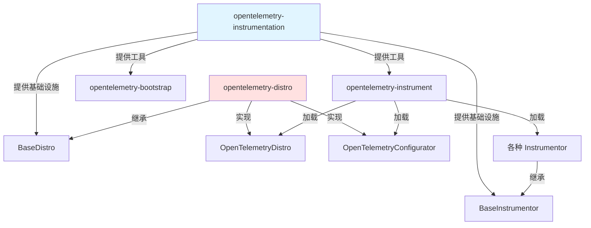
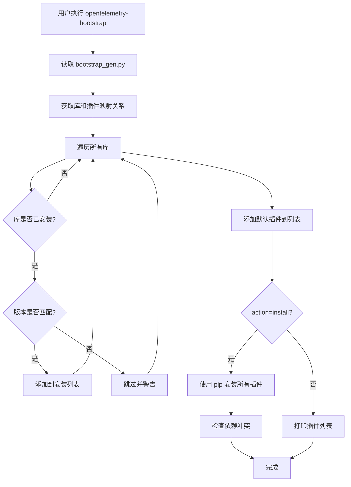
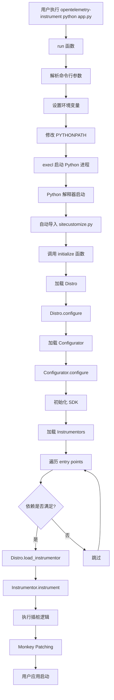
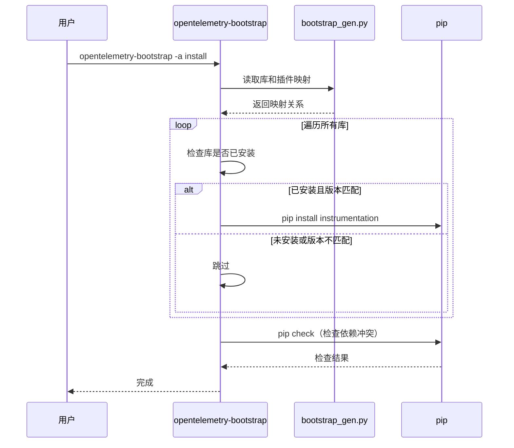
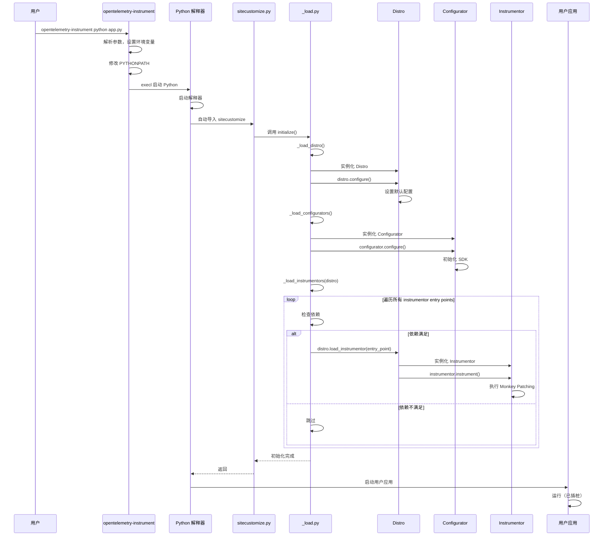

# OpenTelemetry-Distro 和 OpenTelemetry-Instrumentation 原理分析

> 深入分析 Python OpenTelemetry 的自动插桩机制、插件自动安装原理和自动埋点实现

---

## 📋 目录

- [1. 两个包的作用与关系](#1-两个包的作用与关系)
- [2. opentelemetry-instrumentation 详解](#2-opentelemetry-instrumentation-详解)
- [3. opentelemetry-distro 详解](#3-opentelemetry-distro-详解)
- [4. 自动安装插件原理](#4-自动安装插件原理)
- [5. 自动埋点原理](#5-自动埋点原理)
- [6. Entry Points 机制](#6-entry-points-机制)
- [7. 完整工作流程](#7-完整工作流程)
- [8. 核心设计模式](#8-核心设计模式)

---

## 1. 两个包的作用与关系

### 1.1 opentelemetry-instrumentation

**核心作用**：提供自动插桩的**基础设施和工具**

**主要功能**：
- 🔧 **命令行工具**：
  - `opentelemetry-instrument`：自动插桩命令
  - `opentelemetry-bootstrap`：自动安装插件命令
  
- 📦 **基础类库**：
  - `BaseInstrumentor`：所有插桩器的抽象基类
  - `BaseDistro`：发行版的抽象基类
  - 自动加载机制（`_load.py`）
  
- 🔌 **插件发现**：
  - 通过 Entry Points 机制发现已安装的 instrumentor
  - 依赖冲突检测
  - 自动初始化（`sitecustomize.py`）

**包位置**：`opentelemetry-instrumentation`

**关键文件**：
```
opentelemetry-instrumentation/
├── src/opentelemetry/instrumentation/
│   ├── auto_instrumentation/
│   │   ├── __init__.py          # 命令入口和初始化
│   │   ├── _load.py             # 加载 distro/configurator/instrumentor
│   │   └── sitecustomize.py     # Python 启动时自动执行
│   ├── bootstrap.py             # 自动安装插件
│   ├── bootstrap_gen.py         # 库和插件的映射关系
│   ├── instrumentor.py          # BaseInstrumentor 基类
│   └── distro.py                # BaseDistro 基类
```

---

### 1.2 opentelemetry-distro

**核心作用**：提供**默认配置和发行版实现**

**主要功能**：
- ⚙️ **默认配置**：设置默认的 exporter 和协议
- 🎯 **Configurator**：初始化 OpenTelemetry SDK
- 📋 **Distro 实现**：`OpenTelemetryDistro` 类

**包位置**：`opentelemetry-distro`

**关键文件**：
```
opentelemetry-distro/
└── src/opentelemetry/distro/
    └── __init__.py              # OpenTelemetryDistro 和 Configurator
```

**默认配置**：
```python
class OpenTelemetryDistro(BaseDistro):
    def _configure(self, **kwargs):
        # 设置默认的 exporter 为 OTLP
        os.environ.setdefault(OTEL_TRACES_EXPORTER, "otlp")
        os.environ.setdefault(OTEL_METRICS_EXPORTER, "otlp")
        os.environ.setdefault(OTEL_LOGS_EXPORTER, "otlp")
        # 设置默认协议为 gRPC
        os.environ.setdefault(OTEL_EXPORTER_OTLP_PROTOCOL, "grpc")
```

---

### 1.3 两者的关系



**依赖关系**：
- `opentelemetry-distro` **依赖** `opentelemetry-instrumentation`
- `opentelemetry-instrumentation` 提供框架，`opentelemetry-distro` 提供实现
- 用户可以只安装 `opentelemetry-instrumentation`，但需要自己实现 Distro
- 推荐安装 `opentelemetry-distro` 以获得开箱即用的体验

---

## 2. opentelemetry-instrumentation 详解

### 2.1 BaseInstrumentor - 插桩器基类

**作用**：定义所有插桩器的标准接口

**核心代码**：
```python
class BaseInstrumentor(ABC):
    """所有插桩器的抽象基类"""
    
    _instance = None  # 单例模式
    _is_instrumented_by_opentelemetry = False
    
    @abstractmethod
    def instrumentation_dependencies(self) -> Collection[str]:
        """声明要插桩的库及其版本要求
        
        例如：
        return ['flask >= 1.0', 'werkzeug >= 0.16']
        """
        pass
    
    @abstractmethod
    def _instrument(self, **kwargs):
        """执行插桩逻辑（子类实现）"""
        pass
    
    @abstractmethod
    def _uninstrument(self, **kwargs):
        """移除插桩（子类实现）"""
        pass
    
    def instrument(self, **kwargs):
        """公开的插桩方法
        
        包含：
        1. 防止重复插桩检查
        2. 依赖冲突检测
        3. 调用 _instrument
        4. 标记已插桩
        """
        if self._is_instrumented_by_opentelemetry:
            _LOG.warning("Attempting to instrument while already instrumented")
            return None
        
        # 检查依赖冲突
        if not skip_dep_check:
            conflict = self._check_dependency_conflicts()
            if conflict:
                _LOG.error(conflict)
                return None
        
        result = self._instrument(**kwargs)
        self._is_instrumented_by_opentelemetry = True
        return result
```

**关键特性**：
- ✅ **单例模式**：每个 Instrumentor 只有一个实例
- ✅ **防重复插桩**：通过 `_is_instrumented_by_opentelemetry` 标志
- ✅ **依赖检测**：自动检查目标库是否安装及版本是否匹配
- ✅ **异常处理**：插桩失败不影响应用启动

---

### 2.2 BaseDistro - 发行版基类

**作用**：定义发行版的标准接口，允许自定义配置

**核心代码**：
```python
class BaseDistro(ABC):
    """发行版抽象基类"""
    
    _instance = None  # 单例模式
    
    def __new__(cls, *args, **kwargs):
        if cls._instance is None:
            cls._instance = object.__new__(cls, *args, **kwargs)
        return cls._instance
    
    @abstractmethod
    def _configure(self, **kwargs):
        """配置发行版（子类实现）
        
        例如：设置默认的 exporter、采样率等
        """
        pass
    
    def configure(self, **kwargs):
        """公开的配置方法"""
        self._configure(**kwargs)
    
    def load_instrumentor(self, entry_point: EntryPoint, **kwargs):
        """加载并激活一个 instrumentor
        
        默认行为：
        1. 加载 entry point
        2. 实例化 instrumentor
        3. 调用 instrument()
        
        子类可以重写此方法来：
        - 传递自定义参数
        - 跳过某些 instrumentor
        - 加载替代实现
        """
        instrumentor: BaseInstrumentor = entry_point.load()
        instrumentor().instrument(**kwargs)
```

**关键特性**：
- ✅ **单例模式**：全局唯一的 Distro 实例
- ✅ **模板方法模式**：`configure()` 调用 `_configure()`
- ✅ **可扩展性**：子类可以重写 `load_instrumentor()` 自定义加载行为

---

### 2.3 自动加载机制 (_load.py)

**作用**：在 Python 启动时自动加载 Distro、Configurator 和 Instrumentor

#### 2.3.1 加载 Distro

```python
def _load_distro() -> BaseDistro:
    """加载 Distro
    
    优先级：
    1. 环境变量 OTEL_PYTHON_DISTRO 指定的 distro
    2. 第一个找到的有效 distro
    3. DefaultDistro（空实现）
    """
    distro_name = environ.get(OTEL_PYTHON_DISTRO, None)
    
    # 遍历所有注册的 distro entry points
    for entry_point in entry_points(group="opentelemetry_distro"):
        if distro_name is None or distro_name == entry_point.name:
            distro = entry_point.load()()
            if isinstance(distro, BaseDistro):
                _logger.debug("Distribution %s will be configured", entry_point.name)
                return distro
    
    # 没有找到，返回默认实现
    return DefaultDistro()
```

#### 2.3.2 加载 Configurator

```python
def _load_configurators():
    """加载 Configurator 并初始化 SDK
    
    Configurator 负责：
    1. 创建 TracerProvider
    2. 创建 MeterProvider
    3. 创建 LoggerProvider
    4. 配置 Exporter
    5. 配置 Processor
    """
    configurator_name = environ.get(OTEL_PYTHON_CONFIGURATOR, None)
    
    for entry_point in entry_points(group="opentelemetry_configurator"):
        if configurator_name is None or configurator_name == entry_point.name:
            # 调用 configure() 方法初始化 SDK
            entry_point.load()().configure(auto_instrumentation_version=__version__)
            break
```

#### 2.3.3 加载 Instrumentor

```python
def _load_instrumentors(distro):
    """加载所有 Instrumentor 并执行插桩
    
    流程：
    1. 获取禁用列表（OTEL_PYTHON_DISABLED_INSTRUMENTATIONS）
    2. 执行 pre_instrument 钩子
    3. 遍历所有 instrumentor entry points
    4. 检查依赖冲突
    5. 调用 distro.load_instrumentor()
    6. 执行 post_instrument 钩子
    """
    # 获取禁用列表
    package_to_exclude = environ.get(OTEL_PYTHON_DISABLED_INSTRUMENTATIONS, [])
    if isinstance(package_to_exclude, str):
        package_to_exclude = package_to_exclude.split(",")
    
    # 执行 pre_instrument 钩子
    for entry_point in entry_points(group="opentelemetry_pre_instrument"):
        entry_point.load()()
    
    # 加载所有 instrumentor
    for entry_point in entry_points(group="opentelemetry_instrumentor"):
        # 检查是否被禁用
        if entry_point.name in package_to_exclude:
            continue
        
        try:
            # 检查依赖冲突
            conflict = get_dist_dependency_conflicts(entry_point_dist)
            if conflict:
                _logger.debug("Skipping instrumentation %s: %s", entry_point.name, conflict)
                continue
            
            # 加载并插桩
            distro.load_instrumentor(entry_point, skip_dep_check=True)
            _logger.debug("Instrumented %s", entry_point.name)
            
        except ModuleNotFoundError:
            # 目标库未安装，跳过
            continue
        except ImportError:
            # 导入失败，跳过（避免影响其他插桩）
            _logger.exception("Importing of %s failed, skipping it", entry_point.name)
            continue
    
    # 执行 post_instrument 钩子
    for entry_point in entry_points(group="opentelemetry_post_instrument"):
        entry_point.load()()
```

**关键特性**：
- ✅ **容错设计**：单个插桩失败不影响其他插桩
- ✅ **依赖检测**：自动跳过未安装或版本不匹配的库
- ✅ **可配置**：支持禁用特定插桩
- ✅ **钩子机制**：支持 pre/post instrument 钩子

---

### 2.4 sitecustomize.py - 自动初始化

**作用**：Python 启动时自动执行，触发自动插桩

**原理**：Python 解释器在启动时会自动导入 `sitecustomize` 模块（如果存在）

**代码**：
```python
# sitecustomize.py
from opentelemetry.instrumentation.auto_instrumentation import initialize

initialize()
```

**initialize() 函数**：
```python
def initialize(*, swallow_exceptions: bool = True) -> None:
    """自动插桩初始化
    
    流程：
    1. 清理 PYTHONPATH（防止子进程重复插桩）
    2. 可选：Gevent Monkey Patching
    3. 加载 Distro 并配置
    4. 加载 Configurator（初始化 SDK）
    5. 加载 Instrumentors（插桩各个库）
    """
    # 1. 清理 PYTHONPATH
    if "PYTHONPATH" in environ:
        environ["PYTHONPATH"] = _python_path_without_directory(
            environ["PYTHONPATH"], dirname(abspath(__file__)), pathsep
        )
    
    # 2. Gevent Monkey Patching（可选）
    gevent_patch = environ.get(OTEL_PYTHON_AUTO_INSTRUMENTATION_EXPERIMENTAL_GEVENT_PATCH)
    if gevent_patch == "patch_all":
        from gevent import monkey
        monkey.patch_all()
    
    try:
        # 3. 加载 Distro 并配置
        distro = _load_distro()
        distro.configure()
        
        # 4. 加载 Configurator（初始化 SDK）
        _load_configurators()
        
        # 5. 加载 Instrumentors（插桩各个库）
        _load_instrumentors(distro)
        
    except Exception as exc:
        _logger.exception("Failed to auto initialize OpenTelemetry")
        if not swallow_exceptions:
            raise exc
```

**关键特性**：
- ✅ **自动执行**：无需手动调用
- ✅ **异常吞掉**：默认吞掉异常，避免影响应用启动
- ✅ **防重复插桩**：清理 PYTHONPATH 防止子进程重复插桩

---

### 2.5 opentelemetry-instrument 命令

**作用**：命令行工具，启动应用并自动插桩

**使用方式**：
```bash
opentelemetry-instrument \
    --service_name my-service \
    --traces_exporter otlp \
    --metrics_exporter otlp \
    python your_app.py
```

**实现原理**：
```python
def run() -> None:
    """命令行入口
    
    流程：
    1. 解析命令行参数
    2. 将参数转换为环境变量
    3. 修改 PYTHONPATH，注入 sitecustomize.py 路径
    4. 使用 execl 替换当前进程，启动应用
    """
    parser = ArgumentParser()
    
    # 1. 动态生成命令行参数（基于 entry points）
    for entry_point in entry_points(group="opentelemetry_environment_variables"):
        environment_variable_module = entry_point.load()
        for attribute in dir(environment_variable_module):
            if attribute.startswith("OTEL_"):
                argument = sub(r"OTEL_(PYTHON_)?", "", attribute).lower()
                parser.add_argument(f"--{argument}", required=False)
    
    parser.add_argument("command", help="Your Python application.")
    parser.add_argument("command_args", nargs=REMAINDER)
    
    args = parser.parse_args()
    
    # 2. 将参数转换为环境变量
    for argument, otel_environment_variable in argument_otel_environment_variable.items():
        value = getattr(args, argument)
        if value is not None:
            environ[otel_environment_variable] = value
    
    # 3. 修改 PYTHONPATH，注入 sitecustomize.py 路径
    python_path = environ.get("PYTHONPATH", "").split(pathsep)
    filedir_path = dirname(abspath(__file__))  # sitecustomize.py 所在目录
    python_path.insert(0, filedir_path)
    environ["PYTHONPATH"] = pathsep.join(python_path)
    
    # 4. 使用 execl 替换当前进程
    executable = which(args.command)
    execl(executable, executable, *args.command_args)
```

**关键点**：
- ✅ **进程替换**：使用 `execl` 替换当前进程，不是创建子进程
- ✅ **PYTHONPATH 注入**：将 `sitecustomize.py` 所在目录添加到 PYTHONPATH
- ✅ **环境变量传递**：命令行参数转换为环境变量
- ✅ **动态参数**：基于 entry points 动态生成命令行参数

---

## 3. opentelemetry-distro 详解

### 3.1 OpenTelemetryDistro

**作用**：提供默认的配置

**代码**：
```python
class OpenTelemetryDistro(BaseDistro):
    """OpenTelemetry 官方提供的默认 Distro"""
    
    def _configure(self, **kwargs):
        """设置默认配置"""
        # 默认使用 OTLP exporter
        os.environ.setdefault(OTEL_TRACES_EXPORTER, "otlp")
        os.environ.setdefault(OTEL_METRICS_EXPORTER, "otlp")
        os.environ.setdefault(OTEL_LOGS_EXPORTER, "otlp")
        
        # 默认使用 gRPC 协议
        os.environ.setdefault(OTEL_EXPORTER_OTLP_PROTOCOL, "grpc")
```

**Entry Point 注册**：
```toml
# pyproject.toml
[project.entry-points.opentelemetry_distro]
distro = "opentelemetry.distro:OpenTelemetryDistro"
```

---

### 3.2 OpenTelemetryConfigurator

**作用**：初始化 OpenTelemetry SDK

**代码**：
```python
class OpenTelemetryConfigurator(_OTelSDKConfigurator):
    """继承自 SDK 的 Configurator
    
    负责：
    1. 创建 TracerProvider
    2. 创建 MeterProvider
    3. 创建 LoggerProvider
    4. 配置 Exporter
    5. 配置 Processor
    6. 配置 Resource
    """
    pass
```

**Entry Point 注册**：
```toml
# pyproject.toml
[project.entry-points.opentelemetry_configurator]
configurator = "opentelemetry.distro:OpenTelemetryConfigurator"
```

---

## 4. 自动安装插件原理

### 4.1 opentelemetry-bootstrap 命令

**作用**：自动检测已安装的库，并安装对应的 instrumentation 包

**使用方式**：
```bash
# 列出需要安装的插件
opentelemetry-bootstrap

# 自动安装插件
opentelemetry-bootstrap -a install
```

---

### 4.2 实现原理

#### 4.2.1 库和插件的映射关系

**bootstrap_gen.py**：定义了库和插件的映射关系

```python
# bootstrap_gen.py
libraries = [
    {
        "library": "flask >= 1.0",
        "instrumentation": "opentelemetry-instrumentation-flask==0.61b0.dev",
    },
    {
        "library": "requests ~= 2.0",
        "instrumentation": "opentelemetry-instrumentation-requests==0.61b0.dev",
    },
    {
        "library": "django >= 1.10",
        "instrumentation": "opentelemetry-instrumentation-django==0.61b0.dev",
    },
    # ... 更多映射
]

# 默认安装的插件（不需要检测）
default_instrumentations = [
    "opentelemetry-instrumentation-asyncio==0.61b0.dev",
    "opentelemetry-instrumentation-logging==0.61b0.dev",
    "opentelemetry-instrumentation-sqlite3==0.61b0.dev",
    # ...
]
```

**注意**：这个文件是自动生成的，通过脚本扫描所有 instrumentation 包生成

---

#### 4.2.2 检测已安装的库

```python
def _is_installed(req):
    """检查库是否已安装且版本匹配
    
    参数：
        req: 库的要求，例如 "flask >= 1.0"
    
    返回：
        True: 已安装且版本匹配
        False: 未安装或版本不匹配
    """
    req = Requirement(req)
    
    try:
        # 获取已安装的版本
        dist_version = version(req.name)
    except PackageNotFoundError:
        return False
    
    # 检查版本是否满足要求
    if not req.specifier.filter(dist_version):
        logger.warning(
            "instrumentation for package %s is available"
            " but version %s is installed. Skipping.",
            req,
            dist_version,
        )
        return False
    
    return True


def _find_installed_libraries(default_instrumentations, libraries):
    """查找需要安装的插件
    
    返回：
        生成器，产生需要安装的插件包名
    """
    # 1. 默认插件（总是安装）
    for lib in default_instrumentations:
        yield lib
    
    # 2. 检测到的插件（根据已安装的库）
    for lib in libraries:
        if _is_installed(lib["library"]):
            yield lib["instrumentation"]
```

---

#### 4.2.3 安装插件

```python
def _run_install(default_instrumentations, libraries):
    """安装所有需要的插件
    
    流程：
    1. 查找需要安装的插件
    2. 使用 pip 安装
    3. 检查依赖冲突
    """
    # 1. 查找需要安装的插件
    for lib in _find_installed_libraries(default_instrumentations, libraries):
        # 2. 使用 pip 安装
        _sys_pip_install(lib)
    
    # 3. 检查依赖冲突
    _pip_check(libraries)


def _sys_pip_install(package):
    """使用 pip 安装包"""
    check_call([
        sys.executable,
        "-m",
        "pip",
        "install",
        "-U",
        "--upgrade-strategy",
        "only-if-needed",
        package,
    ])
```

---

### 4.3 工作流程图



---

## 5. 自动埋点原理

### 5.1 整体流程



---

### 5.2 关键步骤详解

#### 5.2.1 步骤 1：修改 PYTHONPATH

**目的**：让 Python 解释器能找到 `sitecustomize.py`

**代码**：
```python
# 获取 sitecustomize.py 所在目录
filedir_path = dirname(abspath(__file__))

# 将该目录添加到 PYTHONPATH 的最前面
python_path = environ.get("PYTHONPATH", "").split(pathsep)
python_path.insert(0, filedir_path)
environ["PYTHONPATH"] = pathsep.join(python_path)
```

**结果**：
```
PYTHONPATH=/path/to/opentelemetry/instrumentation/auto_instrumentation:/other/paths
```

---

#### 5.2.2 步骤 2：Python 自动导入 sitecustomize

**原理**：Python 解释器在启动时会自动查找并导入 `sitecustomize` 模块

**Python 源码**（简化）**：
```python
# Python 解释器启动时
import site

# site 模块会尝试导入 sitecustomize
try:
    import sitecustomize
except ImportError:
    pass
```

**我们的 sitecustomize.py**：
```python
from opentelemetry.instrumentation.auto_instrumentation import initialize

initialize()
```

---

#### 5.2.3 步骤 3：加载 Distro

**代码**：
```python
def _load_distro() -> BaseDistro:
    distro_name = environ.get(OTEL_PYTHON_DISTRO, None)
    
    # 遍历所有注册的 distro entry points
    for entry_point in entry_points(group="opentelemetry_distro"):
        if distro_name is None or distro_name == entry_point.name:
            distro = entry_point.load()()
            if isinstance(distro, BaseDistro):
                return distro
    
    return DefaultDistro()
```

**Entry Points 查找**：
```python
# 查找所有 group="opentelemetry_distro" 的 entry points
# 例如：
# [project.entry-points.opentelemetry_distro]
# distro = "opentelemetry.distro:OpenTelemetryDistro"
```

---

#### 5.2.4 步骤 4：Distro 配置

**代码**：
```python
distro = _load_distro()
distro.configure()
```

**OpenTelemetryDistro 的配置**：
```python
def _configure(self, **kwargs):
    # 设置默认的 exporter
    os.environ.setdefault(OTEL_TRACES_EXPORTER, "otlp")
    os.environ.setdefault(OTEL_METRICS_EXPORTER, "otlp")
    os.environ.setdefault(OTEL_LOGS_EXPORTER, "otlp")
    os.environ.setdefault(OTEL_EXPORTER_OTLP_PROTOCOL, "grpc")
```

---

#### 5.2.5 步骤 5：加载 Configurator

**代码**：
```python
def _load_configurators():
    configurator_name = environ.get(OTEL_PYTHON_CONFIGURATOR, None)
    
    for entry_point in entry_points(group="opentelemetry_configurator"):
        if configurator_name is None or configurator_name == entry_point.name:
            # 调用 configure() 初始化 SDK
            entry_point.load()().configure(auto_instrumentation_version=__version__)
            break
```

**Configurator 的职责**：
1. 创建 `TracerProvider`
2. 创建 `MeterProvider`
3. 创建 `LoggerProvider`
4. 配置 `Exporter`（根据环境变量）
5. 配置 `Processor`
6. 配置 `Resource`（服务名、版本等）
7. 设置全局 Provider

---

#### 5.2.6 步骤 6：加载 Instrumentors

**代码**：
```python
def _load_instrumentors(distro):
    # 获取禁用列表
    package_to_exclude = environ.get(OTEL_PYTHON_DISABLED_INSTRUMENTATIONS, [])
    
    # 遍历所有 instrumentor entry points
    for entry_point in entry_points(group="opentelemetry_instrumentor"):
        if entry_point.name in package_to_exclude:
            continue
        
        try:
            # 检查依赖冲突
            conflict = get_dist_dependency_conflicts(entry_point_dist)
            if conflict:
                continue
            
            # 加载并插桩
            distro.load_instrumentor(entry_point, skip_dep_check=True)
            
        except ModuleNotFoundError:
            # 目标库未安装，跳过
            continue
```

**Distro.load_instrumentor**：
```python
def load_instrumentor(self, entry_point: EntryPoint, **kwargs):
    # 1. 加载 instrumentor 类
    instrumentor: BaseInstrumentor = entry_point.load()
    
    # 2. 实例化（单例）
    instance = instrumentor()
    
    # 3. 调用 instrument()
    instance.instrument(**kwargs)
```

---

#### 5.2.7 步骤 7：执行插桩

**BaseInstrumentor.instrument()**：
```python
def instrument(self, **kwargs):
    # 1. 检查是否已插桩
    if self._is_instrumented_by_opentelemetry:
        return None
    
    # 2. 检查依赖冲突
    if not skip_dep_check:
        conflict = self._check_dependency_conflicts()
        if conflict:
            return None
    
    # 3. 调用子类的 _instrument()
    result = self._instrument(**kwargs)
    
    # 4. 标记已插桩
    self._is_instrumented_by_opentelemetry = True
    
    return result
```

**子类的 _instrument() 实现**（以 Flask 为例）：
```python
class FlaskInstrumentor(BaseInstrumentor):
    def _instrument(self, **kwargs):
        # 1. 导入目标库
        import flask
        
        # 2. Monkey Patching：替换关键方法
        original_wsgi_app = flask.Flask.wsgi_app
        
        def instrumented_wsgi_app(self, environ, start_response):
            # 创建 Span
            with tracer.start_as_current_span("flask.request") as span:
                # 设置 Span 属性
                span.set_attribute("http.method", environ["REQUEST_METHOD"])
                span.set_attribute("http.url", environ["PATH_INFO"])
                
                # 调用原始方法
                return original_wsgi_app(self, environ, start_response)
        
        # 替换方法
        flask.Flask.wsgi_app = instrumented_wsgi_app
```

---

### 5.3 Monkey Patching 原理

**什么是 Monkey Patching？**

在运行时动态修改类或模块的行为，而不修改源代码。

**示例**：
```python
# 原始代码
class MyClass:
    def method(self):
        return "original"

# Monkey Patching
original_method = MyClass.method

def new_method(self):
    print("Before")
    result = original_method(self)
    print("After")
    return result

MyClass.method = new_method

# 使用
obj = MyClass()
obj.method()  # 输出: Before, original, After
```

**OpenTelemetry 的应用**：
```python
# Flask Instrumentor
import flask

# 保存原始方法
original_wsgi_app = flask.Flask.wsgi_app

# 定义包装方法
def instrumented_wsgi_app(self, environ, start_response):
    with tracer.start_as_current_span("flask.request") as span:
        # 添加埋点逻辑
        span.set_attribute("http.method", environ["REQUEST_METHOD"])
        
        # 调用原始方法
        return original_wsgi_app(self, environ, start_response)

# 替换方法
flask.Flask.wsgi_app = instrumented_wsgi_app
```

**优点**：
- ✅ 无需修改应用代码
- ✅ 对应用透明
- ✅ 可以在运行时启用/禁用

**缺点**：
- ❌ 可能与其他 Monkey Patching 冲突
- ❌ 调试困难
- ❌ 依赖库的内部实现

---

## 6. Entry Points 机制

### 6.1 什么是 Entry Points？

**定义**：Python 的插件发现机制，允许包声明可被其他包发现的入口点

**类比**：类似于 Java 的 SPI（Service Provider Interface）

---

### 6.2 如何定义 Entry Points？

**在 pyproject.toml 中定义**：
```toml
[project.entry-points.opentelemetry_instrumentor]
flask = "opentelemetry.instrumentation.flask:FlaskInstrumentor"
requests = "opentelemetry.instrumentation.requests:RequestsInstrumentor"

[project.entry-points.opentelemetry_distro]
distro = "opentelemetry.distro:OpenTelemetryDistro"

[project.entry-points.opentelemetry_configurator]
configurator = "opentelemetry.distro:OpenTelemetryConfigurator"
```

**格式**：
```
[project.entry-points.<group>]
<name> = "<module>:<class>"
```

---

### 6.3 如何查找 Entry Points？

**代码**：
```python
from opentelemetry.util._importlib_metadata import entry_points

# 查找所有 opentelemetry_instrumentor 组的 entry points
for entry_point in entry_points(group="opentelemetry_instrumentor"):
    print(f"Name: {entry_point.name}")
    print(f"Value: {entry_point.value}")
    
    # 加载类
    instrumentor_class = entry_point.load()
    
    # 实例化
    instrumentor = instrumentor_class()
```

**输出示例**：
```
Name: flask
Value: opentelemetry.instrumentation.flask:FlaskInstrumentor

Name: requests
Value: opentelemetry.instrumentation.requests:RequestsInstrumentor
```

---

### 6.4 OpenTelemetry 使用的 Entry Point 组

| 组名 | 用途 | 示例 |
|------|------|------|
| `opentelemetry_instrumentor` | 注册 Instrumentor | FlaskInstrumentor |
| `opentelemetry_distro` | 注册 Distro | OpenTelemetryDistro |
| `opentelemetry_configurator` | 注册 Configurator | OpenTelemetryConfigurator |
| `opentelemetry_pre_instrument` | 插桩前钩子 | - |
| `opentelemetry_post_instrument` | 插桩后钩子 | - |
| `opentelemetry_environment_variables` | 环境变量定义 | 用于生成命令行参数 |

---

## 7. 完整工作流程

### 7.1 自动安装插件流程



---

### 7.2 自动埋点流程



---

## 8. 核心设计模式

### 8.1 单例模式

**应用**：`BaseInstrumentor` 和 `BaseDistro`

**目的**：确保每个 Instrumentor 和 Distro 只有一个实例

**实现**：
```python
class BaseInstrumentor(ABC):
    _instance = None
    
    def __new__(cls, *args, **kwargs):
        if cls._instance is None:
            cls._instance = object.__new__(cls)
        return cls._instance
```

---

### 8.2 模板方法模式

**应用**：`BaseDistro.configure()` 和 `BaseInstrumentor.instrument()`

**目的**：定义算法骨架，子类实现具体步骤

**实现**：
```python
class BaseDistro(ABC):
    @abstractmethod
    def _configure(self, **kwargs):
        """子类实现"""
        pass
    
    def configure(self, **kwargs):
        """模板方法"""
        self._configure(**kwargs)
```

---

### 8.3 策略模式

**应用**：`Distro.load_instrumentor()`

**目的**：允许子类自定义 Instrumentor 的加载行为

**实现**：
```python
class BaseDistro(ABC):
    def load_instrumentor(self, entry_point: EntryPoint, **kwargs):
        """默认策略：直接加载并插桩"""
        instrumentor = entry_point.load()
        instrumentor().instrument(**kwargs)

class CustomDistro(BaseDistro):
    def load_instrumentor(self, entry_point: EntryPoint, **kwargs):
        """自定义策略：传递额外参数"""
        if entry_point.name == "flask":
            kwargs["enable_commenter"] = True
        super().load_instrumentor(entry_point, **kwargs)
```

---

### 8.4 插件架构

**应用**：Entry Points 机制

**目的**：实现可扩展的插件系统

**优点**：
- ✅ 松耦合：插件和框架独立
- ✅ 可扩展：轻松添加新插件
- ✅ 自动发现：无需手动注册

---

## 9. 总结

### 9.1 核心要点

1. **opentelemetry-instrumentation**：
   - 提供基础设施（BaseInstrumentor、BaseDistro）
   - 提供工具（opentelemetry-instrument、opentelemetry-bootstrap）
   - 实现自动加载机制

2. **opentelemetry-distro**：
   - 提供默认配置
   - 实现 Configurator（初始化 SDK）
   - 可选安装，但推荐使用

3. **自动安装插件**：
   - 通过 `opentelemetry-bootstrap` 命令
   - 检测已安装的库
   - 自动安装对应的 instrumentation 包

4. **自动埋点**：
   - 通过 `opentelemetry-instrument` 命令
   - 利用 `sitecustomize.py` 自动初始化
   - 使用 Entry Points 发现插件
   - 通过 Monkey Patching 实现插桩

5. **Entry Points**：
   - Python 的插件发现机制
   - 实现松耦合的插件架构
   - 支持多种类型的扩展点

---

### 9.2 与 Java Agent 对比

| 特性 | Python (opentelemetry-instrument) | Java (javaagent) |
|------|-----------------------------------|------------------|
| **实现方式** | Monkey Patching | 字节码增强 |
| **启动方式** | 命令行包装 | -javaagent 参数 |
| **插桩时机** | 运行时（导入时） | 类加载时 |
| **性能开销** | 中等 | 较低 |
| **灵活性** | 高（可运行时禁用） | 低（需重启） |
| **调试难度** | 较高 | 中等 |

---

### 9.3 最佳实践

1. **开发环境**：
   - 使用 `opentelemetry-instrument` 快速验证
   - 使用 `opentelemetry-bootstrap` 自动安装插件

2. **生产环境**：
   - 明确指定需要的 instrumentation 包
   - 使用环境变量配置
   - 监控性能开销

3. **自定义需求**：
   - 实现自定义 Distro
   - 重写 `load_instrumentor()` 方法
   - 使用 pre/post instrument 钩子

4. **混合使用**：
   - 自动插桩 + 手动添加自定义 Span
   - 禁用不需要的 Instrumentor
   - 按需配置采样率

---

## 10. 参考资源

- [OpenTelemetry Python 文档](https://opentelemetry.io/docs/languages/python/)
- [自动插桩指南](https://opentelemetry.io/docs/languages/python/automatic/)
- [源码仓库](https://github.com/open-telemetry/opentelemetry-python-contrib)
