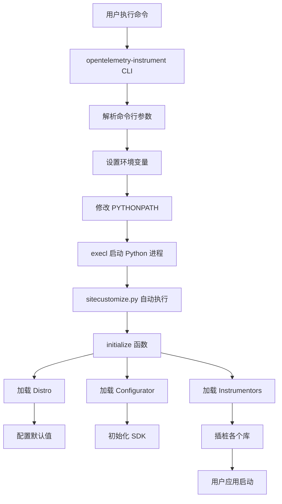
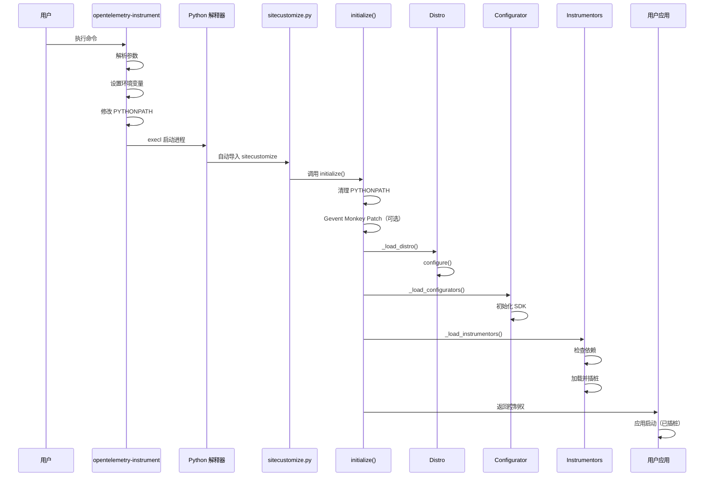

# OpenTelemetry-Instrument 深度分析

> 本文档深入分析 Python OpenTelemetry 自动插桩工具 `opentelemetry-instrument` 的实现机制、架构设计和工作原理。

## 📋 目录

- [1. 概述](#1-概述)
- [2. 架构设计](#2-架构设计)
- [3. 核心组件](#3-核心组件)
- [4. 工作流程](#4-工作流程)
- [5. 关键实现细节](#5-关键实现细节)
- [6. 扩展机制](#6-扩展机制)
- [7. 与 Java Agent 对比](#7-与-java-agent-对比)
- [8. 最佳实践](#8-最佳实践)

---

## 1. 概述

### 1.1 什么是 opentelemetry-instrument？

`opentelemetry-instrument` 是 OpenTelemetry Python 提供的**自动插桩命令行工具**，它能够：

- 🚀 **零代码修改**：无需修改应用代码即可启用 OpenTelemetry
- 🔌 **自动发现**：自动检测并插桩已安装的库（如 Flask、Django、requests 等）
- ⚙️ **灵活配置**：通过命令行参数或环境变量配置
- 📦 **可扩展**：支持自定义 Distro 和 Instrumentor

### 1.2 基本用法

```bash
opentelemetry-instrument \
    --service_name my-service \
    --traces_exporter otlp \
    --metrics_exporter otlp \
    python your_app.py
```

### 1.3 实现位置

| 组件 | 包名 | 路径 |
|------|------|------|
| **命令入口** | `opentelemetry-instrumentation` | `auto_instrumentation/__init__.py` |
| **加载逻辑** | `opentelemetry-instrumentation` | `auto_instrumentation/_load.py` |
| **自动初始化** | `opentelemetry-instrumentation` | `auto_instrumentation/sitecustomize.py` |
| **Distro 基类** | `opentelemetry-instrumentation` | `distro.py` |
| **默认 Distro** | `opentelemetry-distro` | `distro/__init__.py` |

---

## 2. 架构设计

### 2.1 整体架构图



### 2.2 核心设计模式

#### 2.2.1 插件架构（Entry Points）

使用 Python 的 **Entry Points** 机制实现插件化：

```python
# pyproject.toml 中定义 entry points
[project.entry-points.opentelemetry_distro]
opentelemetry_distro = "opentelemetry.distro:OpenTelemetryDistro"

[project.entry-points.opentelemetry_instrumentor]
flask = "opentelemetry.instrumentation.flask:FlaskInstrumentor"
requests = "opentelemetry.instrumentation.requests:RequestsInstrumentor"
```

#### 2.2.2 单例模式（Distro）

`BaseDistro` 使用单例模式确保全局唯一：

```python
class BaseDistro(ABC):
    _instance = None

    def __new__(cls, *args, **kwargs):
        if cls._instance is None:
            cls._instance = object.__new__(cls, *args, **kwargs)
        return cls._instance
```

#### 2.2.3 模板方法模式

`BaseDistro` 定义抽象方法 `_configure`，子类实现具体配置：

```python
class BaseDistro(ABC):
    @abstractmethod
    def _configure(self, **kwargs):
        """子类实现具体配置逻辑"""
        
    def configure(self, **kwargs):
        """模板方法"""
        self._configure(**kwargs)
```

---

## 3. 核心组件

### 3.1 命令行入口（run 函数）

**文件位置**: `auto_instrumentation/__init__.py`

#### 3.1.1 主要职责

1. **解析命令行参数**：动态生成参数（基于 entry points）
2. **设置环境变量**：将参数转换为环境变量
3. **修改 PYTHONPATH**：注入 `sitecustomize.py` 路径
4. **启动应用**：使用 `execl` 替换当前进程

#### 3.1.2 关键代码分析

```python
def run() -> None:
    parser = ArgumentParser(...)
    
    # 1. 动态生成命令行参数（从 entry points）
    argument_otel_environment_variable = {}
    for entry_point in entry_points(group="opentelemetry_environment_variables"):
        environment_variable_module = entry_point.load()
        for attribute in dir(environment_variable_module):
            if attribute.startswith("OTEL_"):
                argument = sub(r"OTEL_(PYTHON_)?", "", attribute).lower()
                parser.add_argument(f"--{argument}", required=False)
                argument_otel_environment_variable[argument] = attribute
    
    # 2. 解析参数
    args = parser.parse_args()
    
    # 3. 设置环境变量
    for argument, otel_environment_variable in argument_otel_environment_variable.items():
        value = getattr(args, argument)
        if value is not None:
            environ[otel_environment_variable] = value
    
    # 4. 修改 PYTHONPATH（关键！）
    python_path = environ.get("PYTHONPATH", "").split(pathsep)
    filedir_path = dirname(abspath(__file__))  # sitecustomize.py 所在目录
    python_path.insert(0, filedir_path)
    environ["PYTHONPATH"] = pathsep.join(python_path)
    
    # 5. 启动应用（替换当前进程）
    executable = which(args.command)
    execl(executable, executable, *args.command_args)
```

#### 3.1.3 为什么修改 PYTHONPATH？

Python 在启动时会自动导入 `sitecustomize.py`（如果在 `PYTHONPATH` 中找到），这是实现**零代码侵入**的关键！

---

### 3.2 自动初始化（sitecustomize.py）

**文件位置**: `auto_instrumentation/sitecustomize.py`

#### 3.2.1 工作原理

```python
from opentelemetry.instrumentation.auto_instrumentation import initialize

initialize()
```

**执行时机**：Python 解释器启动后、用户代码执行前

**作用**：触发自动插桩的初始化流程

---

### 3.3 初始化函数（initialize）

**文件位置**: `auto_instrumentation/__init__.py`

#### 3.3.1 主要流程

```python
def initialize(*, swallow_exceptions: bool = True) -> None:
    # 1. 清理 PYTHONPATH（防止子进程重复插桩）
    if "PYTHONPATH" in environ:
        environ["PYTHONPATH"] = _python_path_without_directory(
            environ["PYTHONPATH"], dirname(abspath(__file__)), pathsep
        )
    
    # 2. 可选：Gevent Monkey Patching
    gevent_patch = environ.get(OTEL_PYTHON_AUTO_INSTRUMENTATION_EXPERIMENTAL_GEVENT_PATCH)
    if gevent_patch == "patch_all":
        from gevent import monkey
        monkey.patch_all()
    
    # 3. 加载 Distro 并配置
    distro = _load_distro()
    distro.configure()
    
    # 4. 加载 Configurator（初始化 SDK）
    _load_configurators()
    
    # 5. 加载 Instrumentors（插桩各个库）
    _load_instrumentors(distro)
```

#### 3.3.2 异常处理策略

- **默认行为**：吞掉异常，记录日志（`swallow_exceptions=True`）
- **原因**：避免插桩失败导致应用无法启动
- **可配置**：测试时可设置 `swallow_exceptions=False`

---

### 3.4 Distro 加载器（_load_distro）

**文件位置**: `auto_instrumentation/_load.py`

#### 3.4.1 加载逻辑

```python
def _load_distro() -> BaseDistro:
    distro_name = environ.get(OTEL_PYTHON_DISTRO, None)
    
    # 遍历所有注册的 distro entry points
    for entry_point in entry_points(group="opentelemetry_distro"):
        try:
            # 如果未指定 distro，使用第一个找到的
            if distro_name is None or distro_name == entry_point.name:
                distro = entry_point.load()()
                if not isinstance(distro, BaseDistro):
                    _logger.debug("%s is not an OpenTelemetry Distro. Skipping", entry_point.name)
                    continue
                _logger.debug("Distribution %s will be configured", entry_point.name)
                return distro
        except Exception as exc:
            _logger.exception("Distribution %s configuration failed", entry_point.name)
            raise exc
    
    # 如果没有找到任何 distro，返回默认实现
    return DefaultDistro()
```

#### 3.4.2 Distro 选择优先级

1. **环境变量指定**：`OTEL_PYTHON_DISTRO=custom_distro`
2. **第一个找到的**：如果未指定，使用第一个有效的 distro
3. **默认实现**：`DefaultDistro`（空实现）

---

### 3.5 Instrumentor 加载器（_load_instrumentors）

**文件位置**: `auto_instrumentation/_load.py`

#### 3.5.1 加载流程

```python
def _load_instrumentors(distro):
    # 1. 获取禁用列表
    package_to_exclude = environ.get(OTEL_PYTHON_DISABLED_INSTRUMENTATIONS, [])
    if isinstance(package_to_exclude, str):
        package_to_exclude = package_to_exclude.split(",")
        package_to_exclude = [x.strip() for x in package_to_exclude]
    
    # 2. 执行 pre_instrument 钩子
    for entry_point in entry_points(group="opentelemetry_pre_instrument"):
        entry_point.load()()
    
    # 3. 加载所有 instrumentor
    for entry_point in entry_points(group="opentelemetry_instrumentor"):
        # 检查是否被禁用
        if entry_point.name in package_to_exclude:
            _logger.debug("Instrumentation skipped for library %s", entry_point.name)
            continue
        
        try:
            # 检查依赖冲突
            entry_point_dist = entry_point_finder.dist_for(entry_point)
            conflict = get_dist_dependency_conflicts(entry_point_dist)
            if conflict:
                _logger.debug("Skipping instrumentation %s: %s", entry_point.name, conflict)
                continue
            
            # 加载并插桩
            distro.load_instrumentor(entry_point, skip_dep_check=True)
            _logger.debug("Instrumented %s", entry_point.name)
            
        except ModuleNotFoundError as exc:
            # 库未安装，跳过
            _logger.debug("Skipping instrumentation %s: %s", entry_point.name, exc.msg)
            continue
        except ImportError:
            # 导入失败（如二进制扩展不兼容），跳过
            _logger.exception("Importing of %s failed, skipping it", entry_point.name)
            continue
    
    # 4. 执行 post_instrument 钩子
    for entry_point in entry_points(group="opentelemetry_post_instrument"):
        entry_point.load()()
```

#### 3.5.2 错误处理策略

| 异常类型 | 处理方式 | 原因 |
|---------|---------|------|
| `DependencyConflictError` | 跳过，记录日志 | 依赖版本不兼容 |
| `ModuleNotFoundError` | 跳过，记录日志 | 目标库未安装 |
| `ImportError` | 跳过，记录异常 | 二进制扩展不兼容（K8s Operator 场景） |
| 其他异常 | 抛出异常 | 严重错误 |

#### 3.5.3 禁用 Instrumentor

```bash
# 禁用单个
export OTEL_PYTHON_DISABLED_INSTRUMENTATIONS=requests

# 禁用多个
export OTEL_PYTHON_DISABLED_INSTRUMENTATIONS=requests,flask,django

# 禁用所有
export OTEL_PYTHON_DISABLED_INSTRUMENTATIONS=*
```

---

### 3.6 Configurator 加载器（_load_configurators）

**文件位置**: `auto_instrumentation/_load.py`

#### 3.6.1 作用

Configurator 负责**初始化 OpenTelemetry SDK**（TracerProvider、MeterProvider、LoggerProvider 等）。

#### 3.6.2 加载逻辑

```python
def _load_configurators():
    configurator_name = environ.get(OTEL_PYTHON_CONFIGURATOR, None)
    configured = None
    
    for entry_point in entry_points(group="opentelemetry_configurator"):
        # 只允许加载一个 configurator
        if configured is not None:
            _logger.warning("Configuration of %s not loaded, %s already loaded",
                          entry_point.name, configured)
            continue
        
        try:
            if configurator_name is None or configurator_name == entry_point.name:
                entry_point.load()().configure(auto_instrumentation_version=__version__)
                configured = entry_point.name
        except Exception as exc:
            _logger.exception("Configuration of %s failed", entry_point.name)
            raise exc
```

#### 3.6.3 与 Distro 的区别

| 特性 | Distro | Configurator |
|------|--------|--------------|
| **职责** | 设置默认环境变量 | 初始化 SDK（Provider、Exporter） |
| **执行时机** | 在 Configurator 之前 | 在 Distro 之后 |
| **数量限制** | 可以有多个（但只加载一个） | 只能加载一个 |
| **典型实现** | `OpenTelemetryDistro` | `_OTelSDKConfigurator` |

---

## 4. 工作流程

### 4.1 完整执行流程



### 4.2 关键时间点

| 阶段 | 时间点 | 说明 |
|------|--------|------|
| **命令解析** | T0 | 用户执行 `opentelemetry-instrument` |
| **进程启动** | T1 | `execl` 启动新的 Python 进程 |
| **自动导入** | T2 | Python 导入 `sitecustomize.py` |
| **Distro 配置** | T3 | 设置默认环境变量 |
| **SDK 初始化** | T4 | 创建 Provider 和 Exporter |
| **插桩完成** | T5 | 所有 Instrumentor 加载完成 |
| **应用启动** | T6 | 用户代码开始执行 |

---

## 5. 关键实现细节

### 5.1 PYTHONPATH 操作

#### 5.1.1 为什么要修改 PYTHONPATH？

```python
# 在 run() 函数中
filedir_path = dirname(abspath(__file__))  # sitecustomize.py 所在目录
python_path.insert(0, filedir_path)
environ["PYTHONPATH"] = pathsep.join(python_path)
```

**原因**：Python 会在 `PYTHONPATH` 中查找 `sitecustomize.py` 并自动导入。

#### 5.1.2 为什么要清理 PYTHONPATH？

```python
# 在 initialize() 函数中
if "PYTHONPATH" in environ:
    environ["PYTHONPATH"] = _python_path_without_directory(
        environ["PYTHONPATH"], dirname(abspath(__file__)), pathsep
    )
```

**原因**：防止子进程（如 `subprocess.Popen`）重复插桩。

---

### 5.2 Entry Points 机制

#### 5.2.1 什么是 Entry Points？

Entry Points 是 Python 包的**插件注册机制**，定义在 `pyproject.toml` 或 `setup.py` 中。

#### 5.2.2 OpenTelemetry 使用的 Entry Point Groups

| Group 名称 | 用途 | 示例 |
|-----------|------|------|
| `opentelemetry_distro` | 注册 Distro | `opentelemetry_distro = "opentelemetry.distro:OpenTelemetryDistro"` |
| `opentelemetry_configurator` | 注册 Configurator | `sdk_configurator = "opentelemetry.sdk._configuration:_OTelSDKConfigurator"` |
| `opentelemetry_instrumentor` | 注册 Instrumentor | `flask = "opentelemetry.instrumentation.flask:FlaskInstrumentor"` |
| `opentelemetry_pre_instrument` | 插桩前钩子 | 用于预处理 |
| `opentelemetry_post_instrument` | 插桩后钩子 | 用于后处理 |
| `opentelemetry_environment_variables` | 环境变量定义 | 用于生成命令行参数 |

#### 5.2.3 如何查看已注册的 Entry Points？

```bash
# 安装 pip-tools
pip install pip-tools

# 查看所有 entry points
python -c "
from opentelemetry.util._importlib_metadata import entry_points
for ep in entry_points(group='opentelemetry_instrumentor'):
    print(f'{ep.name}: {ep.value}')
"
```

---

### 5.3 依赖冲突检测

#### 5.3.1 为什么需要检测？

某些 Instrumentor 对目标库的版本有要求，例如：

```toml
[project.optional-dependencies]
instruments = [
    "flask >= 2.0.0, < 4.0.0",
]
```

如果用户安装的 Flask 版本不符合要求，插桩可能失败。

#### 5.3.2 检测逻辑

```python
from opentelemetry.instrumentation.dependencies import get_dist_dependency_conflicts

conflict = get_dist_dependency_conflicts(entry_point_dist)
if conflict:
    _logger.debug("Skipping instrumentation %s: %s", entry_point.name, conflict)
    continue
```

---

### 5.4 Gevent 支持

#### 5.4.1 为什么需要特殊处理？

Gevent 使用 **Monkey Patching** 替换标准库的 I/O 操作，必须在**所有导入之前**执行。

#### 5.4.2 使用方法

```bash
export OTEL_PYTHON_AUTO_INSTRUMENTATION_EXPERIMENTAL_GEVENT_PATCH=patch_all
opentelemetry-instrument python your_gevent_app.py
```

#### 5.4.3 实现代码

```python
gevent_patch = environ.get(OTEL_PYTHON_AUTO_INSTRUMENTATION_EXPERIMENTAL_GEVENT_PATCH)
if gevent_patch == "patch_all":
    try:
        from gevent import monkey
        monkey.patch_all()
    except ImportError:
        _logger.exception("Failed to monkey patch with gevent because gevent is not available")
```

---

## 6. 扩展机制

### 6.1 自定义 Distro

#### 6.1.1 创建自定义 Distro

```python
# my_distro.py
from opentelemetry.instrumentation.distro import BaseDistro
import os

class MyCustomDistro(BaseDistro):
    def _configure(self, **kwargs):
        # 设置自定义默认值
        os.environ.setdefault("OTEL_SERVICE_NAME", "my-default-service")
        os.environ.setdefault("OTEL_TRACES_EXPORTER", "jaeger")
        os.environ.setdefault("OTEL_EXPORTER_JAEGER_ENDPOINT", "http://localhost:14268/api/traces")
        
        # 自定义日志级别
        os.environ.setdefault("OTEL_LOG_LEVEL", "debug")
```

#### 6.1.2 注册 Distro

```toml
# pyproject.toml
[project.entry-points.opentelemetry_distro]
my_distro = "my_package.my_distro:MyCustomDistro"
```

#### 6.1.3 使用自定义 Distro

```bash
export OTEL_PYTHON_DISTRO=my_distro
opentelemetry-instrument python your_app.py
```

---

### 6.2 自定义 Instrumentor

#### 6.2.1 创建 Instrumentor

```python
# my_instrumentor.py
from opentelemetry.instrumentation.instrumentor import BaseInstrumentor
from opentelemetry.trace import get_tracer

class MyLibraryInstrumentor(BaseInstrumentor):
    def instrumentation_dependencies(self):
        return ["my-library >= 1.0.0"]
    
    def _instrument(self, **kwargs):
        tracer = get_tracer(__name__)
        # 实现插桩逻辑
        # 例如：Monkey Patch 目标库的函数
        import my_library
        original_func = my_library.some_function
        
        def wrapped_func(*args, **kwargs):
            with tracer.start_as_current_span("my_library.some_function"):
                return original_func(*args, **kwargs)
        
        my_library.some_function = wrapped_func
    
    def _uninstrument(self, **kwargs):
        # 恢复原始函数
        pass
```

#### 6.2.2 注册 Instrumentor

```toml
# pyproject.toml
[project.entry-points.opentelemetry_instrumentor]
my_library = "my_package.my_instrumentor:MyLibraryInstrumentor"
```

---

### 6.3 Pre/Post Instrument 钩子

#### 6.3.1 使用场景

- **Pre Instrument**：在所有插桩之前执行（如设置全局配置）
- **Post Instrument**：在所有插桩之后执行（如验证、日志记录）

#### 6.3.2 示例

```python
# pre_instrument_hook.py
def pre_instrument():
    print("About to start instrumentation...")
    # 设置全局配置
    import logging
    logging.basicConfig(level=logging.DEBUG)

# post_instrument_hook.py
def post_instrument():
    print("Instrumentation completed!")
    # 验证插桩是否成功
    from opentelemetry import trace
    tracer = trace.get_tracer(__name__)
    print(f"Tracer: {tracer}")
```

#### 6.3.3 注册钩子

```toml
# pyproject.toml
[project.entry-points.opentelemetry_pre_instrument]
my_pre_hook = "my_package.hooks:pre_instrument"

[project.entry-points.opentelemetry_post_instrument]
my_post_hook = "my_package.hooks:post_instrument"
```

---

## 7. 与 Java Agent 对比

### 7.1 实现机制对比

| 特性 | Python (opentelemetry-instrument) | Java (javaagent.jar) |
|------|-----------------------------------|----------------------|
| **插桩方式** | 运行时 Monkey Patching | 字节码增强（Bytecode Instrumentation） |
| **启动方式** | 命令行包装器 + sitecustomize | `-javaagent` JVM 参数 |
| **自动发现** | Entry Points 机制 | SPI (ServiceLoader) |
| **零代码侵入** | ✅ 是 | ✅ 是 |
| **性能开销** | 中等（函数包装） | 低（字节码级别） |
| **动态加载** | ✅ 支持 | ❌ 需要重启 JVM |
| **跨线程传播** | Context API + 手动包装 | 自动（ThreadLocal + 字节码注入） |

### 7.2 启动方式对比

#### Python

```bash
opentelemetry-instrument \
    --service_name my-service \
    --traces_exporter otlp \
    python app.py
```

**原理**：
1. 修改 `PYTHONPATH`
2. 启动新进程
3. `sitecustomize.py` 自动执行

#### Java

```bash
java -javaagent:opentelemetry-javaagent.jar \
     -Dotel.service.name=my-service \
     -Dotel.traces.exporter=otlp \
     -jar app.jar
```

**原理**：
1. JVM 启动时加载 Agent
2. Agent 注册 `ClassFileTransformer`
3. 类加载时修改字节码

### 7.3 插桩方式对比

#### Python - Monkey Patching

```python
# 示例：插桩 requests 库
import requests

original_request = requests.Session.request

def instrumented_request(self, method, url, **kwargs):
    with tracer.start_as_current_span(f"HTTP {method}"):
        return original_request(self, method, url, **kwargs)

requests.Session.request = instrumented_request
```

**优点**：
- 灵活，可以在运行时修改
- 实现简单

**缺点**：
- 性能开销较大（每次调用都经过包装函数）
- 可能与其他 Monkey Patch 冲突

#### Java - 字节码增强

```java
// 使用 ByteBuddy 修改字节码
new AgentBuilder.Default()
    .type(named("okhttp3.OkHttpClient"))
    .transform((builder, typeDescription, classLoader, module) ->
        builder.method(named("newCall"))
               .intercept(MethodDelegation.to(OkHttpClientInterceptor.class))
    )
    .installOn(instrumentation);
```

**优点**：
- 性能开销低（字节码级别）
- 不会与其他代码冲突

**缺点**：
- 实现复杂
- 需要重启 JVM 才能生效

### 7.4 跨线程传播对比

#### Python

需要**显式启用** `ThreadingInstrumentor`：

```python
from opentelemetry.instrumentation.threading import ThreadingInstrumentor

ThreadingInstrumentor().instrument()
```

**原理**：包装 `threading.Thread` 的 `start()` 和 `run()` 方法。

#### Java

**完全自动**，无需任何配置：

```java
// 自动传播，无需任何代码
ExecutorService executor = Executors.newFixedThreadPool(10);
executor.submit(() -> {
    // Context 自动传播到这里
    Span span = Span.current();
});
```

**原理**：字节码注入 + `ThreadLocal` + `Executor` 包装。

---

## 8. 最佳实践

### 8.1 生产环境部署

#### 8.1.1 使用环境变量而非命令行参数

```bash
# ❌ 不推荐：命令行参数过长
opentelemetry-instrument \
    --service_name my-service \
    --traces_exporter otlp \
    --metrics_exporter otlp \
    --exporter_otlp_endpoint http://collector:4317 \
    python app.py

# ✅ 推荐：使用环境变量
export OTEL_SERVICE_NAME=my-service
export OTEL_TRACES_EXPORTER=otlp
export OTEL_METRICS_EXPORTER=otlp
export OTEL_EXPORTER_OTLP_ENDPOINT=http://collector:4317
opentelemetry-instrument python app.py
```

#### 8.1.2 禁用不需要的 Instrumentor

```bash
# 只插桩 Flask 和 requests，禁用其他
export OTEL_PYTHON_DISABLED_INSTRUMENTATIONS=django,celery,redis
```

#### 8.1.3 使用自定义 Distro

```bash
# 创建公司级别的默认配置
export OTEL_PYTHON_DISTRO=company_distro
```

---

### 8.2 性能优化

#### 8.2.1 采样策略

```bash
# 只采样 10% 的请求
export OTEL_TRACES_SAMPLER=traceidratio
export OTEL_TRACES_SAMPLER_ARG=0.1
```

#### 8.2.2 批量导出

```bash
# 批量导出，减少网络开销
export OTEL_BSP_MAX_QUEUE_SIZE=2048
export OTEL_BSP_MAX_EXPORT_BATCH_SIZE=512
export OTEL_BSP_SCHEDULE_DELAY=5000  # 5秒
```

#### 8.2.3 禁用不必要的信号

```bash
# 只启用 Traces，禁用 Metrics 和 Logs
export OTEL_TRACES_EXPORTER=otlp
export OTEL_METRICS_EXPORTER=none
export OTEL_LOGS_EXPORTER=none
```

---

### 8.3 调试技巧

#### 8.3.1 启用调试日志

```bash
export OTEL_LOG_LEVEL=debug
export OTEL_PYTHON_LOG_LEVEL=debug
opentelemetry-instrument python app.py
```

#### 8.3.2 查看已加载的 Instrumentor

```python
# 在应用代码中添加
from opentelemetry.instrumentation.instrumentor import BaseInstrumentor

for instrumentor in BaseInstrumentor._instance_map.values():
    print(f"Loaded: {instrumentor.__class__.__name__}")
```

#### 8.3.3 使用 Console Exporter 测试

```bash
# 将 Trace 输出到控制台
export OTEL_TRACES_EXPORTER=console
opentelemetry-instrument python app.py
```

---

### 8.4 容器化部署

#### 8.4.1 Dockerfile 示例

```dockerfile
FROM python:3.11-slim

# 安装应用依赖
COPY requirements.txt .
RUN pip install -r requirements.txt

# 安装 OpenTelemetry
RUN pip install opentelemetry-distro opentelemetry-exporter-otlp
RUN opentelemetry-bootstrap -a install

# 复制应用代码
COPY ../../../.. /app
WORKDIR /app

# 使用 opentelemetry-instrument 启动
CMD ["opentelemetry-instrument", "python", "app.py"]
```

#### 8.4.2 Kubernetes 部署

```yaml
apiVersion: apps/v1
kind: Deployment
metadata:
  name: my-app
spec:
  template:
    spec:
      containers:
      - name: app
        image: my-app:latest
        env:
        - name: OTEL_SERVICE_NAME
          value: "my-service"
        - name: OTEL_TRACES_EXPORTER
          value: "otlp"
        - name: OTEL_EXPORTER_OTLP_ENDPOINT
          value: "http://otel-collector:4317"
        - name: OTEL_RESOURCE_ATTRIBUTES
          value: "deployment.environment=production,service.version=1.0.0"
```

---

### 8.5 常见问题排查

#### 8.5.1 插桩未生效

**症状**：应用启动正常，但没有生成 Trace。

**排查步骤**：

1. 检查环境变量是否正确设置
2. 启用调试日志查看加载过程
3. 确认目标库已安装且版本兼容
4. 检查是否被禁用：`echo $OTEL_PYTHON_DISABLED_INSTRUMENTATIONS`

#### 8.5.2 子进程重复插桩

**症状**：使用 `subprocess` 启动子进程时，子进程也被插桩。

**解决方案**：

```python
# 方案 1：清理环境变量
import subprocess
import os

env = os.environ.copy()
env.pop('PYTHONPATH', None)
subprocess.Popen(['python', 'child.py'], env=env)

# 方案 2：使用 execl（不会继承 PYTHONPATH）
os.execl('/usr/bin/python', 'python', 'child.py')
```

#### 8.5.3 与 Gevent 冲突

**症状**：使用 Gevent 时出现 `RecursionError` 或死锁。

**解决方案**：

```bash
# 确保 Gevent Monkey Patch 在最前面
export OTEL_PYTHON_AUTO_INSTRUMENTATION_EXPERIMENTAL_GEVENT_PATCH=patch_all
opentelemetry-instrument python app.py
```

---

## 9. 总结

### 9.1 核心要点

1. **零代码侵入**：通过 `sitecustomize.py` 实现自动插桩
2. **插件化架构**：使用 Entry Points 机制实现扩展
3. **灵活配置**：支持环境变量、命令行参数、自定义 Distro
4. **容错设计**：插桩失败不影响应用启动
5. **跨平台**：纯 Python 实现，无需编译

### 9.2 适用场景

✅ **适合使用 opentelemetry-instrument 的场景**：

- 快速接入 OpenTelemetry（无需修改代码）
- 标准化的 Web 框架（Flask、Django、FastAPI）
- 常见的第三方库（requests、httpx、redis）
- 开发和测试环境

❌ **不适合的场景**：

- 需要精细控制插桩行为
- 自定义协议或框架
- 性能要求极高的场景
- 需要插桩的库不在支持列表中

### 9.3 与手动插桩对比

| 特性 | 自动插桩 (opentelemetry-instrument) | 手动插桩 |
|------|-------------------------------------|---------|
| **代码修改** | ❌ 无需修改 | ✅ 需要修改 |
| **灵活性** | ⭐⭐⭐ 中等 | ⭐⭐⭐⭐⭐ 高 |
| **维护成本** | ⭐⭐⭐⭐⭐ 低 | ⭐⭐ 高 |
| **性能开销** | ⭐⭐⭐ 中等 | ⭐⭐⭐⭐ 低 |
| **覆盖范围** | ⭐⭐⭐⭐ 广（支持的库） | ⭐⭐⭐⭐⭐ 全（任意代码） |

### 9.4 推荐实践

1. **开发阶段**：使用 `opentelemetry-instrument` 快速验证
2. **生产环境**：根据需求选择自动或手动插桩
3. **混合使用**：自动插桩 + 手动添加自定义 Span
4. **持续优化**：监控性能，按需禁用不必要的 Instrumentor

---

## 10. 参考资源

### 10.1 官方文档

- [OpenTelemetry Python 文档](https://opentelemetry.io/docs/languages/python/)
- [自动插桩指南](https://opentelemetry.io/docs/languages/python/automatic/)
- [API 参考](https://opentelemetry-python.readthedocs.io/)

### 10.2 源码仓库

- [opentelemetry-python](https://github.com/open-telemetry/opentelemetry-python)
- [opentelemetry-python-contrib](https://github.com/open-telemetry/opentelemetry-python-contrib)

### 10.3 相关工具

- [opentelemetry-bootstrap](https://opentelemetry.io/docs/languages/python/automatic/): 自动安装 Instrumentor
- [opentelemetry-collector](https://opentelemetry.io/docs/collector/): 数据收集器
- [Jaeger](https://www.jaegertracing.io/): 分布式追踪后端

---

**文档版本**: 1.0  
**最后更新**: 2026-01-04  
**作者**: OpenTelemetry 深度分析
