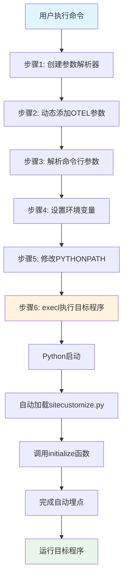
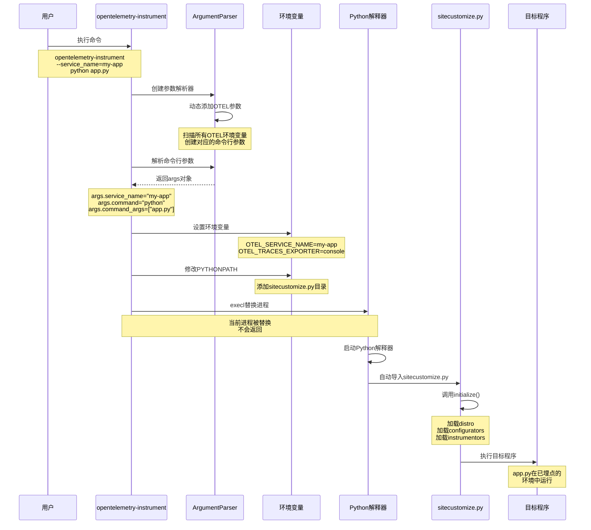

# run() 函数执行流程详解

## 📋 目录
1. [完整执行示例](#完整执行示例)
2. [六大步骤详解](#六大步骤详解)
3. [可视化流程图](#可视化流程图)
4. [关键数据结构](#关键数据结构)
5. [常见问题](#常见问题)

---

## 🎯 完整执行示例

### 用户输入命令
```bash
opentelemetry-instrument \
  --service_name=my-flask-app \
  --traces_exporter=console \
  --metrics_exporter=console \
  python app.py --port 8080 --debug
```

### 执行结果
```bash
# 1. 环境变量被设置
OTEL_SERVICE_NAME=my-flask-app
OTEL_TRACES_EXPORTER=console
OTEL_METRICS_EXPORTER=console

# 2. PYTHONPATH 被修改
PYTHONPATH=/usr/lib/.../auto_instrumentation:/home/user/myapp:/home/user/lib

# 3. 执行目标程序
/usr/bin/python3 app.py --port 8080 --debug

# 4. Python 启动时自动加载 sitecustomize.py
# 5. sitecustomize.py 调用 initialize() 完成自动埋点
# 6. app.py 在已埋点的环境中运行
```

---

## 📖 六大步骤详解

### 步骤 1：创建参数解析器

**代码：**
```python
parser = ArgumentParser(
    description="...",
    epilog="..."
)
```

**作用：**
- 定义 `opentelemetry-instrument` 命令的帮助信息
- 为后续添加参数做准备

**示例：**
```bash
$ opentelemetry-instrument --help
# 显示帮助信息
```

---

### 步骤 2：动态添加 OTEL 参数

**代码：**
```python
argument_otel_environment_variable = {}

for entry_point in entry_points(group="opentelemetry_environment_variables"):
    environment_variable_module = entry_point.load()
    
    for attribute in dir(environment_variable_module):
        if attribute.startswith("OTEL_"):
            argument = sub(r"OTEL_(PYTHON_)?", "", attribute).lower()
            parser.add_argument(f"--{argument}", required=False)
            argument_otel_environment_variable[argument] = attribute
```

**作用：**
- 自动发现所有 OTEL 环境变量
- 为每个环境变量创建对应的命令行参数
- 建立参数名和环境变量名的映射

**转换规则：**

| 环境变量 | 命令行参数 |
|---------|-----------|
| `OTEL_SERVICE_NAME` | `--service_name` |
| `OTEL_TRACES_EXPORTER` | `--traces_exporter` |
| `OTEL_PYTHON_LOGGING_AUTO_INSTRUMENTATION_ENABLED` | `--logging_auto_instrumentation_enabled` |

**转换步骤：**
1. 移除 `OTEL_` 或 `OTEL_PYTHON_` 前缀
2. 转换为小写
3. 添加 `--` 前缀

**映射结果：**
```python
argument_otel_environment_variable = {
    "service_name": "OTEL_SERVICE_NAME",
    "traces_exporter": "OTEL_TRACES_EXPORTER",
    "metrics_exporter": "OTEL_METRICS_EXPORTER",
    # ... 更多参数
}
```

---

### 步骤 3：解析命令行参数

**代码：**
```python
parser.add_argument("command", help="Your Python application.")
parser.add_argument("command_args", help="Arguments for your application.", nargs=REMAINDER)

args = parser.parse_args()
```

**作用：**
- 解析用户输入的命令行参数
- 将参数值存储到 `args` 对象

**示例输入：**
```bash
opentelemetry-instrument --service_name=my-app --traces_exporter=console python app.py --port 8080
```

**解析结果：**
```python
args.service_name = "my-app"
args.traces_exporter = "console"
args.command = "python"
args.command_args = ["app.py", "--port", "8080"]
```

**关键点：**
- `command`：要执行的命令（如 `python`）
- `command_args`：传递给目标程序的所有参数（使用 `REMAINDER` 捕获）

---

### 步骤 4：设置环境变量

**代码：**
```python
for argument, otel_environment_variable in argument_otel_environment_variable.items():
    value = getattr(args, argument)
    if value is not None:
        environ[otel_environment_variable] = value
```

**作用：**
- 将命令行参数值设置为对应的环境变量
- 只设置用户明确指定的参数（值不为 None）

**执行过程：**

| 循环次数 | argument | otel_environment_variable | value | 操作 |
|---------|----------|--------------------------|-------|------|
| 1 | `service_name` | `OTEL_SERVICE_NAME` | `"my-app"` | `environ["OTEL_SERVICE_NAME"] = "my-app"` |
| 2 | `traces_exporter` | `OTEL_TRACES_EXPORTER` | `"console"` | `environ["OTEL_TRACES_EXPORTER"] = "console"` |
| 3 | `metrics_exporter` | `OTEL_METRICS_EXPORTER` | `None` | 跳过（未指定） |

**结果：**
```python
os.environ["OTEL_SERVICE_NAME"] = "my-app"
os.environ["OTEL_TRACES_EXPORTER"] = "console"
```

---

### 步骤 5：修改 PYTHONPATH

**代码：**
```python
python_path = environ.get("PYTHONPATH")

if not python_path:
    python_path = []
else:
    python_path = python_path.split(pathsep)

cwd_path = getcwd()
if cwd_path not in python_path:
    python_path.insert(0, cwd_path)

filedir_path = dirname(abspath(__file__))
python_path = [path for path in python_path if path != filedir_path]
python_path.insert(0, filedir_path)

environ["PYTHONPATH"] = pathsep.join(python_path)
```

**作用：**
- 将 `sitecustomize.py` 所在目录添加到 PYTHONPATH 的最前面
- 确保 Python 启动时能自动加载 `sitecustomize.py`

**执行过程：**

假设：
- 当前目录：`/home/user/myapp`
- sitecustomize.py 位于：`/usr/lib/python3.9/site-packages/opentelemetry/instrumentation/auto_instrumentation/`
- 原始 PYTHONPATH：`/home/user/lib:/usr/local/lib`

| 步骤 | 操作 | 结果 |
|-----|------|------|
| 5.1 | 获取 PYTHONPATH | `"/home/user/lib:/usr/local/lib"` |
| 5.2 | 分割为列表 | `["/home/user/lib", "/usr/local/lib"]` |
| 5.3 | 获取当前目录 | `cwd_path = "/home/user/myapp"` |
| 5.4 | 添加当前目录 | `["/home/user/myapp", "/home/user/lib", "/usr/local/lib"]` |
| 5.5 | 获取 sitecustomize.py 目录 | `filedir_path = "/usr/lib/.../auto_instrumentation"` |
| 5.6 | 移除旧的 sitecustomize.py 目录 | `["/home/user/myapp", "/home/user/lib", "/usr/local/lib"]` |
| 5.7 | 添加 sitecustomize.py 目录到最前面 | `["/usr/lib/.../auto_instrumentation", "/home/user/myapp", "/home/user/lib", "/usr/local/lib"]` |
| 5.8 | 转换回字符串并设置 | `environ["PYTHONPATH"] = "..."` |

**最终 PYTHONPATH：**
```
/usr/lib/python3.9/site-packages/opentelemetry/instrumentation/auto_instrumentation:/home/user/myapp:/home/user/lib:/usr/local/lib
```

**为什么要这样做？**
- Python 启动时会自动导入 `sitecustomize.py`（如果在 PYTHONPATH 中）
- `sitecustomize.py` 会调用 `initialize()` 函数完成自动埋点
- 通过将 sitecustomize.py 目录放在最前面，确保优先加载

---

### 步骤 6：执行目标程序

**代码：**
```python
executable = which(args.command)
execl(executable, executable, *args.command_args)
```

**作用：**
- 查找命令的完整路径
- 使用 `execl` 替换当前进程，执行目标程序

**执行过程：**

| 步骤 | 操作 | 结果 |
|-----|------|------|
| 6.1 | 查找命令路径 | `executable = which("python")` → `"/usr/bin/python3"` |
| 6.2 | 替换当前进程 | `execl("/usr/bin/python3", "/usr/bin/python3", "app.py", "--port", "8080")` |

**execl 参数说明：**
```python
execl(
    "/usr/bin/python3",      # 要执行的程序路径
    "/usr/bin/python3",      # argv[0]（程序名）
    "app.py",                # argv[1]
    "--port",                # argv[2]
    "8080"                   # argv[3]
)
```

**等价命令：**
```bash
/usr/bin/python3 app.py --port 8080
```

**关键点：**
- `execl` 会替换当前进程，不会返回
- 环境变量已设置（OTEL_SERVICE_NAME 等）
- PYTHONPATH 已修改（包含 sitecustomize.py）
- Python 启动时会自动加载 sitecustomize.py
- sitecustomize.py 调用 initialize() 完成自动埋点
- 最终 app.py 在已埋点的环境中运行

---

## 🎨 可视化流程图



### 详细流程图



---

## 📊 关键数据结构

### 1. args 对象（解析后的参数）

```python
args = Namespace(
    service_name="my-app",
    traces_exporter="console",
    metrics_exporter=None,
    command="python",
    command_args=["app.py", "--port", "8080"]
)
```

### 2. argument_otel_environment_variable 映射

```python
argument_otel_environment_variable = {
    "service_name": "OTEL_SERVICE_NAME",
    "traces_exporter": "OTEL_TRACES_EXPORTER",
    "metrics_exporter": "OTEL_METRICS_EXPORTER",
    "exporter_otlp_endpoint": "OTEL_EXPORTER_OTLP_ENDPOINT",
    "exporter_otlp_headers": "OTEL_EXPORTER_OTLP_HEADERS",
    "resource_attributes": "OTEL_RESOURCE_ATTRIBUTES",
    # ... 更多映射
}
```

### 3. 环境变量（执行前后对比）

**执行前：**
```python
os.environ = {
    "PATH": "/usr/bin:/bin",
    "HOME": "/home/user",
    "PYTHONPATH": "/home/user/lib",
    # ... 其他环境变量
}
```

**执行后：**
```python
os.environ = {
    "PATH": "/usr/bin:/bin",
    "HOME": "/home/user",
    "PYTHONPATH": "/usr/lib/.../auto_instrumentation:/home/user/myapp:/home/user/lib",
    "OTEL_SERVICE_NAME": "my-app",
    "OTEL_TRACES_EXPORTER": "console",
    # ... 其他环境变量
}
```

### 4. PYTHONPATH 变化

```python
# 原始
PYTHONPATH = "/home/user/lib:/usr/local/lib"

# 分割为列表
python_path = ["/home/user/lib", "/usr/local/lib"]

# 添加当前目录
python_path = ["/home/user/myapp", "/home/user/lib", "/usr/local/lib"]

# 添加 sitecustomize.py 目录
python_path = [
    "/usr/lib/python3.9/site-packages/opentelemetry/instrumentation/auto_instrumentation",
    "/home/user/myapp",
    "/home/user/lib",
    "/usr/local/lib"
]

# 最终
PYTHONPATH = "/usr/lib/.../auto_instrumentation:/home/user/myapp:/home/user/lib:/usr/local/lib"
```

---

## ❓ 常见问题

### Q1: 为什么要使用 execl 而不是 subprocess？

**答：**
- `execl` 会替换当前进程，不会创建新进程
- 这样可以保持进程 ID 不变
- 环境变量会被继承
- 更加轻量级

### Q2: sitecustomize.py 是如何被自动加载的？

**答：**
- Python 启动时会自动查找并导入 `sitecustomize.py`
- 查找路径由 `PYTHONPATH` 决定
- 通过将 sitecustomize.py 目录添加到 PYTHONPATH，确保能被找到

### Q3: 命令行参数和环境变量的优先级？

**答：**
- 命令行参数优先级更高
- 如果同时设置了环境变量和命令行参数，命令行参数会覆盖环境变量
- 示例：
  ```bash
  export OTEL_SERVICE_NAME=from-env
  opentelemetry-instrument --service_name=from-cli python app.py
  # 最终：OTEL_SERVICE_NAME=from-cli
  ```

### Q4: 为什么要将当前目录添加到 PYTHONPATH？

**答：**
- 支持 Django 等框架从当前目录导入模块
- 例如 Django 的 `manage.py` 需要导入当前目录的模块

### Q5: execl 之后的代码会执行吗？

**答：**
- 不会！`execl` 会替换当前进程
- `execl` 之后的代码永远不会被执行
- 这就是为什么 `run()` 函数没有返回值

### Q6: 如何调试 run() 函数？

**答：**
- 使用我创建的 `debug_auto_instrumentation.py` 脚本
- 在 `run()` 函数内设置断点
- 在 `execl` 之前设置断点，查看最终的环境变量和参数

---

## 🎯 完整执行示例（带时间线）

```
时间线：opentelemetry-instrument --service_name=my-app python app.py --port 8080
================================================================================

T0: 用户执行命令
    $ opentelemetry-instrument --service_name=my-app python app.py --port 8080

T1: Python 启动 opentelemetry-instrument 脚本
    进程 PID: 12345

T2: 调用 run() 函数
    ├─ 创建 ArgumentParser
    ├─ 动态添加 OTEL 参数（约 50+ 个）
    └─ 添加 command 和 command_args 参数

T3: 解析命令行参数
    args.service_name = "my-app"
    args.command = "python"
    args.command_args = ["app.py", "--port", "8080"]

T4: 设置环境变量
    environ["OTEL_SERVICE_NAME"] = "my-app"

T5: 修改 PYTHONPATH
    原始: /home/user/lib
    修改后: /usr/lib/.../auto_instrumentation:/home/user/myapp:/home/user/lib

T6: 执行 execl
    executable = "/usr/bin/python3"
    execl("/usr/bin/python3", "/usr/bin/python3", "app.py", "--port", "8080")

T7: 当前进程被替换
    进程 PID: 12345（不变）
    程序: /usr/bin/python3 app.py --port 8080

T8: Python 解释器启动
    ├─ 读取 PYTHONPATH
    ├─ 查找 sitecustomize.py
    └─ 找到: /usr/lib/.../auto_instrumentation/sitecustomize.py

T9: 自动导入 sitecustomize.py
    import sitecustomize

T10: sitecustomize.py 调用 initialize()
    ├─ 加载 distro
    ├─ 加载 configurators
    └─ 加载 instrumentors（自动埋点）

T11: 执行 app.py
    app.py 在已埋点的环境中运行
    所有 HTTP 请求、数据库查询等都会被自动追踪

T12: 程序正常运行
    Flask 应用监听 8080 端口
    所有 trace 数据输出到 console
```

---

## 🔍 调试技巧

### 1. 查看解析后的参数

在 `args = parser.parse_args()` 之后添加：
```python
print(f"Parsed args: {args}")
```

### 2. 查看环境变量设置

在环境变量设置循环中添加：
```python
for argument, otel_environment_variable in argument_otel_environment_variable.items():
    value = getattr(args, argument)
    if value is not None:
        print(f"Setting {otel_environment_variable} = {value}")
        environ[otel_environment_variable] = value
```

### 3. 查看 PYTHONPATH 变化

在 PYTHONPATH 设置后添加：
```python
print(f"Final PYTHONPATH: {environ['PYTHONPATH']}")
```

### 4. 查看最终执行的命令

在 `execl` 之前添加：
```python
print(f"Executing: {executable} {' '.join(args.command_args)}")
print(f"Environment variables:")
for key, value in environ.items():
    if key.startswith("OTEL_"):
        print(f"  {key} = {value}")
```

---

## 📚 相关文件

- **run() 函数源码**: `opentelemetry-instrumentation/src/opentelemetry/instrumentation/auto_instrumentation/__init__.py`
- **sitecustomize.py**: `opentelemetry-instrumentation/src/opentelemetry/instrumentation/auto_instrumentation/sitecustomize.py`
- **调试脚本**: `debug_auto_instrumentation.py`

---

## 🎓 学习建议

1. **第一遍**：通读整个文档，理解整体流程
2. **第二遍**：对照源码，理解每一步的实现
3. **第三遍**：使用调试脚本，单步执行，观察变量变化
4. **第四遍**：修改参数，观察不同场景下的行为

---

**祝你学习愉快！🚀**
