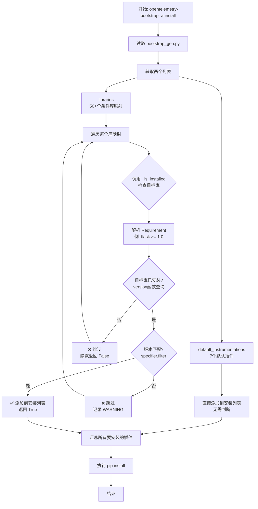

# OpenTelemetry Bootstrap 判断是否安装库的完整流程

## 📊 核心判断逻辑概览

OpenTelemetry Bootstrap 通过 **三层判断机制** 来决定是否安装某个 instrumentation 库：

```
1. 库分类判断 → 默认库 vs 条件库
2. 安装检测判断 → 目标库是否已安装
3. 版本匹配判断 → 版本是否符合要求
```

---

## 🔍 完整决策流程图



---

## 🎯 三层判断机制详解

### **第一层：库分类判断**

在 `_find_installed_libraries()` 函数中：

```python
def _find_installed_libraries(default_instrumentations, libraries):
    # 第一类：默认插件 - 无条件安装
    for lib in default_instrumentations:
        yield lib  # 直接返回，不做任何检查
    
    # 第二类：条件插件 - 需要判断
    for lib in libraries:
        if _is_installed(lib["library"]):  # 调用判断函数
            yield lib["instrumentation"]
```

#### **分类标准**

| 类别 | 判断依据 | 数量 | 示例 |
|------|---------|------|------|
| **默认插件** | Python 标准库/内置模块 | 7个 | asyncio, logging, threading, sqlite3 |
| **条件插件** | 第三方库 | 50+ | flask, django, requests, redis |

#### **为什么默认插件不需要判断？**

```python
# 这些是 Python 标准库，100% 存在于任何 Python 环境中
default_instrumentations = [
    "opentelemetry-instrumentation-asyncio",   # asyncio 是标准库
    "opentelemetry-instrumentation-logging",   # logging 是标准库
    "opentelemetry-instrumentation-threading", # threading 是标准库
    # ...
]
```

---

### **第二层：安装检测判断**

在 `_is_installed()` 函数中：

```python
def _is_installed(req):
    req = Requirement(req)  # 解析 "flask >= 1.0"
    
    try:
        # 核心判断：查询系统中是否安装了该库
        dist_version = version(req.name)  # 调用 importlib.metadata.version()
    except PackageNotFoundError:
        # 未安装 → 返回 False
        return False
    
    # 已安装 → 继续第三层判断
    # ...
```

#### **检测机制**

使用 Python 标准库 `importlib.metadata.version()` 查询：

```python
from importlib.metadata import version, PackageNotFoundError

# 示例 1：已安装
>>> version("flask")
'2.3.0'  # 返回版本号

# 示例 2：未安装
>>> version("some-nonexistent-package")
PackageNotFoundError  # 抛出异常
```

#### **判断结果**

| 情况 | 返回值 | 后续动作 |
|------|--------|---------|
| 库未安装 | `False` | ❌ 跳过该库的插件安装 |
| 库已安装 | 继续判断 | ➡️ 进入第三层判断 |

---

### **第三层：版本匹配判断**

继续在 `_is_installed()` 函数中：

```python
def _is_installed(req):
    # ... 前面已经确认库已安装 ...
    
    # 核心判断：版本是否满足要求
    if not req.specifier.filter(dist_version):
        # 版本不匹配 → 记录警告并返回 False
        logger.warning(
            "instrumentation for package %s is available"
            " but version %s is installed. Skipping.",
            req,           # 例如: "flask>=1.0"
            dist_version,  # 例如: "0.9.0"
        )
        return False
    
    # 版本匹配 → 返回 True
    return True
```

#### **版本匹配机制**

使用 `packaging.specifiers.SpecifierSet.filter()` 进行 PEP 440 标准的版本匹配：

```python
from packaging.requirements import Requirement

# 示例 1：版本匹配
req = Requirement("flask >= 1.0")
req.specifier.filter("2.3.0")  # 返回 ['2.3.0'] → True
# 结果：✅ 安装 opentelemetry-instrumentation-flask

# 示例 2：版本不匹配
req = Requirement("flask >= 2.0")
req.specifier.filter("1.5.0")  # 返回 [] → False
# 结果：❌ 跳过，记录警告

# 示例 3：复杂约束
req = Requirement("celery >= 4.0, < 6.0")
req.specifier.filter("5.2.0")  # 返回 ['5.2.0'] → True
req.specifier.filter("6.1.0")  # 返回 [] → False
```

#### **判断结果**

| 情况 | 返回值 | 日志 | 后续动作 |
|------|--------|------|---------|
| 版本匹配 | `True` | 无 | ✅ 安装对应的插件 |
| 版本不匹配 | `False` | WARNING | ❌ 跳过该库的插件安装 |

---

## 💡 实际案例分析

### **案例 1：Flask 应用（版本匹配）**

**系统环境**：
```bash
$ pip list | grep -i flask
Flask  2.3.0
```

**判断流程**：

```python
# bootstrap_gen.py 中的配置
{
    "library": "flask >= 1.0",
    "instrumentation": "opentelemetry-instrumentation-flask==0.61b0.dev"
}

# 执行判断
_is_installed("flask >= 1.0")
  ↓
1. 解析: Requirement(name="flask", specifier=">=1.0")
  ↓
2. 查询版本: version("flask") → "2.3.0"
  ↓
3. 版本匹配: "2.3.0" >= "1.0" → True
  ↓
结果: ✅ 安装 opentelemetry-instrumentation-flask
```

---

### **案例 2：Django 应用（版本不匹配）**

**系统环境**：
```bash
$ pip list | grep -i django
Django  1.8.0  # 版本过低
```

**判断流程**：

```python
# bootstrap_gen.py 中的配置
{
    "library": "django >= 1.10",
    "instrumentation": "opentelemetry-instrumentation-django==0.61b0.dev"
}

# 执行判断
_is_installed("django >= 1.10")
  ↓
1. 解析: Requirement(name="django", specifier=">=1.10")
  ↓
2. 查询版本: version("django") → "1.8.0"
  ↓
3. 版本匹配: "1.8.0" >= "1.10" → False
  ↓
4. 记录警告:
   WARNING: instrumentation for package django>=1.10 is available
            but version 1.8.0 is installed. Skipping.
  ↓
结果: ❌ 跳过，不安装插件
```

---

### **案例 3：未安装的库**

**系统环境**：
```bash
$ pip list | grep -i redis
# 无输出，未安装
```

**判断流程**：

```python
# bootstrap_gen.py 中的配置
{
    "library": "redis >= 2.6",
    "instrumentation": "opentelemetry-instrumentation-redis==0.61b0.dev"
}

# 执行判断
_is_installed("redis >= 2.6")
  ↓
1. 解析: Requirement(name="redis", specifier=">=2.6")
  ↓
2. 查询版本: version("redis") → PackageNotFoundError
  ↓
3. 捕获异常: return False
  ↓
结果: ❌ 静默跳过，不安装插件
```

---

## 🔧 核心函数源码注释

### **`_find_installed_libraries()` - 主控函数**

```python
def _find_installed_libraries(default_instrumentations, libraries):
    """
    查找所有需要安装的 instrumentation 插件
    
    工作流程：
    1. 无条件返回所有默认插件（标准库）
    2. 遍历条件库，调用 _is_installed() 判断
    3. 只返回判断通过的插件
    
    参数：
        default_instrumentations: 默认插件列表（7个）
        libraries: 条件库映射列表（50+个）
    
    返回：
        生成器，逐个返回要安装的插件包名
    """
    # 第一类：默认插件 - 直接返回
    for lib in default_instrumentations:
        yield lib
    
    # 第二类：条件插件 - 需要判断
    for lib in libraries:
        if _is_installed(lib["library"]):  # 调用判断函数
            yield lib["instrumentation"]
```

### **`_is_installed()` - 判断函数**

```python
def _is_installed(req):
    """
    判断目标库是否已安装且版本符合要求
    
    三步判断：
    1. 解析依赖规范（库名 + 版本约束）
    2. 查询系统中的实际安装版本
    3. 验证版本是否满足约束
    
    参数：
        req: 依赖规范字符串，例如 "flask >= 1.0"
    
    返回：
        True: 已安装且版本匹配
        False: 未安装或版本不匹配
    """
    # 步骤 1：解析依赖规范
    req = Requirement(req)
    
    # 步骤 2：查询实际版本
    try:
        dist_version = version(req.name)
    except PackageNotFoundError:
        return False  # 未安装
    
    # 步骤 3：验证版本
    if not req.specifier.filter(dist_version):
        logger.warning(...)  # 版本不匹配
        return False
    
    return True  # 已安装且版本匹配
```

---

## 📋 判断结果汇总表

| 场景 | 默认插件 | 条件插件（已安装+版本匹配） | 条件插件（已安装+版本不匹配） | 条件插件（未安装） |
|------|---------|---------------------------|------------------------------|------------------|
| **判断逻辑** | 无需判断 | `_is_installed()` 返回 True | `_is_installed()` 返回 False | `_is_installed()` 返回 False |
| **是否安装** | ✅ 安装 | ✅ 安装 | ❌ 跳过 | ❌ 跳过 |
| **日志输出** | 无 | 无 | ⚠️ WARNING | 无 |
| **示例** | logging | flask 2.3.0 (要求 >=1.0) | django 1.8.0 (要求 >=1.10) | redis (未安装) |

---

## 🎯 关键设计思想

### **1. 保守策略**
- 只安装确认兼容的插件
- 版本不匹配时宁可跳过，避免运行时错误

### **2. 静默失败**
- 未安装的库不记录日志（正常情况）
- 版本不匹配才记录警告（需要用户关注）

### **3. 标准库优先**
- 默认插件无需判断，确保基础埋点能力
- 条件插件按需安装，避免依赖膨胀

### **4. PEP 440 标准**
- 使用 Python 官方的版本规范
- 支持复杂的版本约束（>=, ~=, !=, 等）

---

## 🚀 使用建议

### **开发环境**
```bash
# 1. 先安装应用依赖
pip install flask requests redis

# 2. 查看会安装哪些插件（不实际安装）
opentelemetry-bootstrap

# 3. 自动安装插件
opentelemetry-bootstrap -a install
```

### **生产环境**
推荐明确指定版本，而不是使用自动判断：

```txt
# requirements-otel.txt
opentelemetry-distro==0.61b0.dev
opentelemetry-instrumentation-flask==0.61b0.dev
opentelemetry-instrumentation-requests==0.61b0.dev
```

**原因**：
- ✅ 版本可控，构建可重复
- ✅ 避免意外安装不兼容的插件
- ✅ 加快 CI/CD 构建速度

---

## 📚 相关文件

- **判断逻辑**：`bootstrap.py` 中的 `_is_installed()` 和 `_find_installed_libraries()`
- **库映射配置**：`bootstrap_gen.py` 中的 `libraries` 和 `default_instrumentations`
- **配置生成脚本**：`scripts/generate_instrumentation_bootstrap.py`

---

## 🔍 调试技巧

### **查看判断过程**
```bash
# 启用详细日志
export OTEL_LOG_LEVEL=debug
opentelemetry-bootstrap -a install
```

### **手动测试判断逻辑**
```python
from packaging.requirements import Requirement
from importlib.metadata import version

# 测试 flask
req = Requirement("flask >= 1.0")
installed_version = version("flask")
print(f"已安装版本: {installed_version}")
print(f"是否匹配: {bool(req.specifier.filter(installed_version))}")
```

---

## ✅ 总结

OpenTelemetry Bootstrap 的判断逻辑可以总结为：

```
判断是否安装 = 库分类 + 安装检测 + 版本匹配

1. 默认插件（标准库）→ 直接安装
2. 条件插件（第三方库）→ 检查是否已安装
3. 已安装的库 → 检查版本是否匹配
4. 版本匹配 → 安装对应的插件
5. 版本不匹配或未安装 → 跳过
```

这种设计确保了：
- ✅ 只安装兼容的插件
- ✅ 避免运行时错误
- ✅ 提供清晰的警告信息
- ✅ 支持灵活的版本约束
