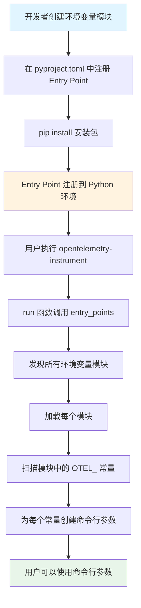
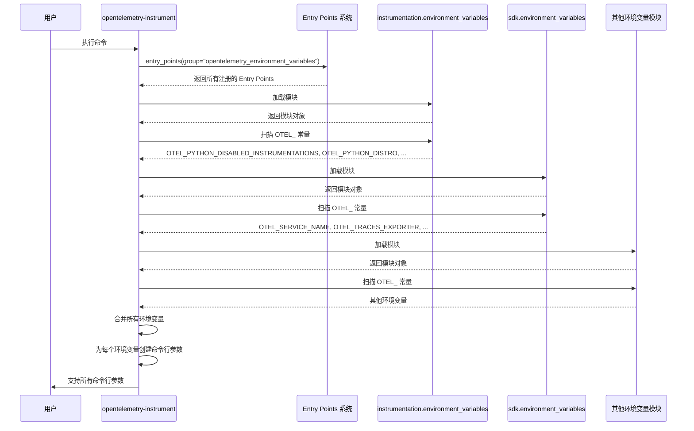

# OpenTelemetry 环境变量模块注册机制详解

## 📋 目录
1. [什么是环境变量模块](#什么是环境变量模块)
2. [Entry Points 机制](#entry-points-机制)
3. [如何注册环境变量模块](#如何注册环境变量模块)
4. [为什么 opentelemetry.sdk.environment_variables 是环境变量模块](#为什么-opentelemetrysdkenvironment_variables-是环境变量模块)
5. [完整示例](#完整示例)
6. [实战演练](#实战演练)

---

## 🎯 什么是环境变量模块

### 定义

**环境变量模块**是一个 Python 模块，其中定义了一组以 `OTEL_` 开头的常量，这些常量代表 OpenTelemetry 的环境变量名称。

### 作用

1. **集中管理**：将所有环境变量名称集中定义在一个地方
2. **避免硬编码**：代码中使用常量而不是字符串字面量
3. **自动发现**：通过 Entry Points 机制，`opentelemetry-instrument` 可以自动发现所有环境变量
4. **生成命令行参数**：自动为每个环境变量生成对应的命令行参数

### 示例

```python
# opentelemetry/instrumentation/environment_variables.py

OTEL_PYTHON_DISABLED_INSTRUMENTATIONS = "OTEL_PYTHON_DISABLED_INSTRUMENTATIONS"
"""
.. envvar:: OTEL_PYTHON_DISABLED_INSTRUMENTATIONS
"""

OTEL_PYTHON_DISTRO = "OTEL_PYTHON_DISTRO"
"""
.. envvar:: OTEL_PYTHON_DISTRO
"""

OTEL_PYTHON_CONFIGURATOR = "OTEL_PYTHON_CONFIGURATOR"
"""
.. envvar:: OTEL_PYTHON_CONFIGURATOR
"""
```

---

## 🔌 Entry Points 机制

### 什么是 Entry Points？

**Entry Points** 是 Python 包的**插件注册机制**，允许包声明它提供的扩展点，其他代码可以在运行时发现和加载这些扩展。

### 定义位置

Entry Points 定义在包的配置文件中：
- **现代方式**：`pyproject.toml`（推荐）
- **传统方式**：`setup.py`

### 格式

```toml
[project.entry-points.<group_name>]
<entry_name> = "<module_path>:<object_name>"
```

或者对于模块级别的注册：

```toml
[project.entry-points.<group_name>]
<entry_name> = "<module_path>"
```

### OpenTelemetry 使用的 Entry Point Groups

| Group 名称 | 用途 | 示例 |
|-----------|------|------|
| `opentelemetry_instrumentor` | 注册 Instrumentor | `flask = "opentelemetry.instrumentation.flask:FlaskInstrumentor"` |
| `opentelemetry_distro` | 注册 Distro | `distro = "opentelemetry.distro:OpenTelemetryDistro"` |
| `opentelemetry_configurator` | 注册 Configurator | `configurator = "opentelemetry.distro:OpenTelemetryConfigurator"` |
| `opentelemetry_pre_instrument` | 插桩前钩子 | 用于预处理 |
| `opentelemetry_post_instrument` | 插桩后钩子 | 用于后处理 |
| **`opentelemetry_environment_variables`** | **注册环境变量模块** | **`instrumentation = "opentelemetry.instrumentation.environment_variables"`** |

---

## 📝 如何注册环境变量模块

### 步骤 1：创建环境变量模块

创建一个 Python 模块，定义所有环境变量常量：

```python
# src/opentelemetry/instrumentation/environment_variables.py

# 每个常量的名称和值相同
OTEL_PYTHON_DISABLED_INSTRUMENTATIONS = "OTEL_PYTHON_DISABLED_INSTRUMENTATIONS"
"""
.. envvar:: OTEL_PYTHON_DISABLED_INSTRUMENTATIONS

禁用的 Instrumentor 列表，用逗号分隔
"""

OTEL_PYTHON_DISTRO = "OTEL_PYTHON_DISTRO"
"""
.. envvar:: OTEL_PYTHON_DISTRO

指定要使用的 Distro
"""

OTEL_PYTHON_CONFIGURATOR = "OTEL_PYTHON_CONFIGURATOR"
"""
.. envvar:: OTEL_PYTHON_CONFIGURATOR

指定要使用的 Configurator
"""

OTEL_PYTHON_AUTO_INSTRUMENTATION_EXPERIMENTAL_GEVENT_PATCH = (
    "OTEL_PYTHON_AUTO_INSTRUMENTATION_EXPERIMENTAL_GEVENT_PATCH"
)
"""
.. envvar:: OTEL_PYTHON_AUTO_INSTRUMENTATION_EXPERIMENTAL_GEVENT_PATCH

是否启用 gevent 补丁（实验性功能）
"""
```

**关键点**：
- ✅ 常量名称必须以 `OTEL_` 开头
- ✅ 常量的值通常与名称相同
- ✅ 建议添加文档字符串说明用途

### 步骤 2：在 pyproject.toml 中注册

在包的 `pyproject.toml` 文件中添加 Entry Point：

```toml
[project.entry-points.opentelemetry_environment_variables]
instrumentation = "opentelemetry.instrumentation.environment_variables"
```

**格式说明**：
- `[project.entry-points.opentelemetry_environment_variables]`：指定 Entry Point 组名
- `instrumentation`：Entry Point 的名称（可以是任意名称，用于标识）
- `"opentelemetry.instrumentation.environment_variables"`：模块路径

### 步骤 3：安装包

安装包后，Entry Point 会被注册到 Python 环境中：

```bash
pip install -e .
```

### 步骤 4：验证注册

可以通过代码验证 Entry Point 是否注册成功：

```python
from opentelemetry.util._importlib_metadata import entry_points

# 查找所有环境变量模块
for entry_point in entry_points(group="opentelemetry_environment_variables"):
    print(f"Name: {entry_point.name}")
    print(f"Value: {entry_point.value}")
    
    # 加载模块
    module = entry_point.load()
    
    # 查看模块中的环境变量
    for attr in dir(module):
        if attr.startswith("OTEL_"):
            print(f"  - {attr} = {getattr(module, attr)}")
```

**输出示例**：
```
Name: instrumentation
Value: opentelemetry.instrumentation.environment_variables
  - OTEL_PYTHON_DISABLED_INSTRUMENTATIONS = OTEL_PYTHON_DISABLED_INSTRUMENTATIONS
  - OTEL_PYTHON_DISTRO = OTEL_PYTHON_DISTRO
  - OTEL_PYTHON_CONFIGURATOR = OTEL_PYTHON_CONFIGURATOR
  - OTEL_PYTHON_AUTO_INSTRUMENTATION_EXPERIMENTAL_GEVENT_PATCH = OTEL_PYTHON_AUTO_INSTRUMENTATION_EXPERIMENTAL_GEVENT_PATCH

Name: sdk
Value: opentelemetry.sdk.environment_variables
  - OTEL_SERVICE_NAME = OTEL_SERVICE_NAME
  - OTEL_TRACES_EXPORTER = OTEL_TRACES_EXPORTER
  - OTEL_METRICS_EXPORTER = OTEL_METRICS_EXPORTER
  - ... 更多环境变量
```

---

## 🔍 为什么 opentelemetry.sdk.environment_variables 是环境变量模块

### 原因分析

`opentelemetry.sdk.environment_variables` 是环境变量模块，因为：

1. **它定义了环境变量常量**
2. **它通过 Entry Points 机制注册**
3. **它被 `opentelemetry-instrument` 自动发现**

### 注册位置

`opentelemetry.sdk.environment_variables` 是在 **opentelemetry-sdk** 包中注册的，不在 contrib 仓库中。

让我们查看 opentelemetry-sdk 的 pyproject.toml（理论上的内容）：

```toml
# opentelemetry-python/opentelemetry-sdk/pyproject.toml

[project]
name = "opentelemetry-sdk"
# ... 其他配置

[project.entry-points.opentelemetry_environment_variables]
sdk = "opentelemetry.sdk.environment_variables"
```

### 模块内容

`opentelemetry.sdk.environment_variables` 模块定义了 SDK 相关的环境变量：

```python
# opentelemetry/sdk/environment_variables.py

# Service 相关
OTEL_SERVICE_NAME = "OTEL_SERVICE_NAME"
OTEL_RESOURCE_ATTRIBUTES = "OTEL_RESOURCE_ATTRIBUTES"

# Traces 相关
OTEL_TRACES_EXPORTER = "OTEL_TRACES_EXPORTER"
OTEL_TRACES_SAMPLER = "OTEL_TRACES_SAMPLER"
OTEL_TRACES_SAMPLER_ARG = "OTEL_TRACES_SAMPLER_ARG"

# Metrics 相关
OTEL_METRICS_EXPORTER = "OTEL_METRICS_EXPORTER"
OTEL_METRICS_EXEMPLAR_FILTER = "OTEL_METRICS_EXEMPLAR_FILTER"

# Logs 相关
OTEL_LOGS_EXPORTER = "OTEL_LOGS_EXPORTER"

# Exporter 相关
OTEL_EXPORTER_OTLP_ENDPOINT = "OTEL_EXPORTER_OTLP_ENDPOINT"
OTEL_EXPORTER_OTLP_HEADERS = "OTEL_EXPORTER_OTLP_HEADERS"
OTEL_EXPORTER_OTLP_PROTOCOL = "OTEL_EXPORTER_OTLP_PROTOCOL"
OTEL_EXPORTER_OTLP_TIMEOUT = "OTEL_EXPORTER_OTLP_TIMEOUT"
OTEL_EXPORTER_OTLP_CERTIFICATE = "OTEL_EXPORTER_OTLP_CERTIFICATE"
OTEL_EXPORTER_OTLP_COMPRESSION = "OTEL_EXPORTER_OTLP_COMPRESSION"

# Span Limits 相关
OTEL_SPAN_ATTRIBUTE_COUNT_LIMIT = "OTEL_SPAN_ATTRIBUTE_COUNT_LIMIT"
OTEL_SPAN_EVENT_COUNT_LIMIT = "OTEL_SPAN_EVENT_COUNT_LIMIT"
OTEL_SPAN_LINK_COUNT_LIMIT = "OTEL_SPAN_LINK_COUNT_LIMIT"
OTEL_EVENT_ATTRIBUTE_COUNT_LIMIT = "OTEL_EVENT_ATTRIBUTE_COUNT_LIMIT"
OTEL_LINK_ATTRIBUTE_COUNT_LIMIT = "OTEL_LINK_ATTRIBUTE_COUNT_LIMIT"

# Attribute 相关
OTEL_ATTRIBUTE_VALUE_LENGTH_LIMIT = "OTEL_ATTRIBUTE_VALUE_LENGTH_LIMIT"
OTEL_ATTRIBUTE_COUNT_LIMIT = "OTEL_ATTRIBUTE_COUNT_LIMIT"

# ... 更多环境变量
```

### 如何被发现

在 `run()` 函数中，通过 Entry Points 机制自动发现：

```python
# opentelemetry/instrumentation/auto_instrumentation/__init__.py

from opentelemetry.util._importlib_metadata import entry_points

# 遍历所有注册的环境变量模块
for entry_point in entry_points(group="opentelemetry_environment_variables"):
    # 加载模块
    # 这里会加载：
    # 1. opentelemetry.instrumentation.environment_variables
    # 2. opentelemetry.sdk.environment_variables
    # 3. 其他注册的环境变量模块
    environment_variable_module = entry_point.load()
    
    # 遍历模块中的所有属性
    for attribute in dir(environment_variable_module):
        if attribute.startswith("OTEL_"):
            # 转换为命令行参数
            # OTEL_SERVICE_NAME → --service_name
            argument = sub(r"OTEL_(PYTHON_)?", "", attribute).lower()
            parser.add_argument(f"--{argument}", required=False)
            argument_otel_environment_variable[argument] = attribute
```

---

## 📊 完整示例

### 示例 1：opentelemetry-instrumentation 包

#### 文件结构
```
opentelemetry-instrumentation/
├── pyproject.toml
└── src/
    └── opentelemetry/
        └── instrumentation/
            ├── __init__.py
            └── environment_variables.py
```

#### pyproject.toml
```toml
[project]
name = "opentelemetry-instrumentation"
# ... 其他配置

[project.entry-points.opentelemetry_environment_variables]
instrumentation = "opentelemetry.instrumentation.environment_variables"
```

#### environment_variables.py
```python
# src/opentelemetry/instrumentation/environment_variables.py

OTEL_PYTHON_DISABLED_INSTRUMENTATIONS = "OTEL_PYTHON_DISABLED_INSTRUMENTATIONS"
OTEL_PYTHON_DISTRO = "OTEL_PYTHON_DISTRO"
OTEL_PYTHON_CONFIGURATOR = "OTEL_PYTHON_CONFIGURATOR"
OTEL_PYTHON_AUTO_INSTRUMENTATION_EXPERIMENTAL_GEVENT_PATCH = (
    "OTEL_PYTHON_AUTO_INSTRUMENTATION_EXPERIMENTAL_GEVENT_PATCH"
)
```

#### 效果

安装 `opentelemetry-instrumentation` 后，`opentelemetry-instrument` 命令会自动支持以下参数：

```bash
opentelemetry-instrument \
  --disabled_instrumentations=flask,requests \
  --distro=my_distro \
  --configurator=my_configurator \
  python app.py
```

这些参数会被转换为环境变量：
```bash
OTEL_PYTHON_DISABLED_INSTRUMENTATIONS=flask,requests
OTEL_PYTHON_DISTRO=my_distro
OTEL_PYTHON_CONFIGURATOR=my_configurator
```

---

### 示例 2：opentelemetry-sdk 包（理论示例）

#### 文件结构
```
opentelemetry-sdk/
├── pyproject.toml
└── src/
    └── opentelemetry/
        └── sdk/
            ├── __init__.py
            └── environment_variables.py
```

#### pyproject.toml
```toml
[project]
name = "opentelemetry-sdk"
# ... 其他配置

[project.entry-points.opentelemetry_environment_variables]
sdk = "opentelemetry.sdk.environment_variables"
```

#### environment_variables.py
```python
# src/opentelemetry/sdk/environment_variables.py

OTEL_SERVICE_NAME = "OTEL_SERVICE_NAME"
OTEL_TRACES_EXPORTER = "OTEL_TRACES_EXPORTER"
OTEL_METRICS_EXPORTER = "OTEL_METRICS_EXPORTER"
OTEL_LOGS_EXPORTER = "OTEL_LOGS_EXPORTER"
OTEL_EXPORTER_OTLP_ENDPOINT = "OTEL_EXPORTER_OTLP_ENDPOINT"
OTEL_EXPORTER_OTLP_HEADERS = "OTEL_EXPORTER_OTLP_HEADERS"
OTEL_EXPORTER_OTLP_PROTOCOL = "OTEL_EXPORTER_OTLP_PROTOCOL"
# ... 更多环境变量
```

#### 效果

安装 `opentelemetry-sdk` 后，`opentelemetry-instrument` 命令会自动支持以下参数：

```bash
opentelemetry-instrument \
  --service_name=my-app \
  --traces_exporter=console \
  --metrics_exporter=prometheus \
  --exporter_otlp_endpoint=http://localhost:4317 \
  python app.py
```

这些参数会被转换为环境变量：
```bash
OTEL_SERVICE_NAME=my-app
OTEL_TRACES_EXPORTER=console
OTEL_METRICS_EXPORTER=prometheus
OTEL_EXPORTER_OTLP_ENDPOINT=http://localhost:4317
```

---

## 🎨 可视化流程图

### Entry Points 注册和发现流程



### 多个环境变量模块的协作



---

## 🚀 实战演练

### 练习 1：创建自定义环境变量模块

假设你要创建一个自定义的 OpenTelemetry 扩展包，需要添加自己的环境变量。

#### 步骤 1：创建项目结构

```bash
mkdir my-otel-extension
cd my-otel-extension

mkdir -p src/my_otel_extension
touch src/my_otel_extension/__init__.py
touch src/my_otel_extension/environment_variables.py
touch pyproject.toml
```

#### 步骤 2：定义环境变量

```python
# src/my_otel_extension/environment_variables.py

OTEL_PYTHON_MY_CUSTOM_SETTING = "OTEL_PYTHON_MY_CUSTOM_SETTING"
"""
.. envvar:: OTEL_PYTHON_MY_CUSTOM_SETTING

我的自定义设置
"""

OTEL_PYTHON_MY_FEATURE_ENABLED = "OTEL_PYTHON_MY_FEATURE_ENABLED"
"""
.. envvar:: OTEL_PYTHON_MY_FEATURE_ENABLED

是否启用我的自定义功能
"""

OTEL_MY_CUSTOM_ENDPOINT = "OTEL_MY_CUSTOM_ENDPOINT"
"""
.. envvar:: OTEL_MY_CUSTOM_ENDPOINT

自定义端点地址
"""
```

#### 步骤 3：配置 pyproject.toml

```toml
[build-system]
requires = ["hatchling"]
build-backend = "hatchling.build"

[project]
name = "my-otel-extension"
version = "0.1.0"
description = "My OpenTelemetry Extension"
requires-python = ">=3.9"
dependencies = [
    "opentelemetry-api",
]

[project.entry-points.opentelemetry_environment_variables]
my_extension = "my_otel_extension.environment_variables"

[tool.hatch.build.targets.wheel]
packages = ["src/my_otel_extension"]
```

#### 步骤 4：安装包

```bash
pip install -e .
```

#### 步骤 5：验证

```python
from opentelemetry.util._importlib_metadata import entry_points

for entry_point in entry_points(group="opentelemetry_environment_variables"):
    if entry_point.name == "my_extension":
        print(f"Found: {entry_point.name} -> {entry_point.value}")
        
        module = entry_point.load()
        for attr in dir(module):
            if attr.startswith("OTEL_"):
                print(f"  - {attr}")
```

**输出**：
```
Found: my_extension -> my_otel_extension.environment_variables
  - OTEL_PYTHON_MY_CUSTOM_SETTING
  - OTEL_PYTHON_MY_FEATURE_ENABLED
  - OTEL_MY_CUSTOM_ENDPOINT
```

#### 步骤 6：使用

现在可以在 `opentelemetry-instrument` 命令中使用这些参数：

```bash
opentelemetry-instrument \
  --my_custom_setting=value1 \
  --my_feature_enabled=true \
  --my_custom_endpoint=http://localhost:8080 \
  python app.py
```

这些参数会被转换为环境变量：
```bash
OTEL_PYTHON_MY_CUSTOM_SETTING=value1
OTEL_PYTHON_MY_FEATURE_ENABLED=true
OTEL_MY_CUSTOM_ENDPOINT=http://localhost:8080
```

---

### 练习 2：查看所有已注册的环境变量模块

创建一个脚本来查看所有已注册的环境变量模块：

```python
# list_env_modules.py

from opentelemetry.util._importlib_metadata import entry_points

print("=" * 80)
print("已注册的环境变量模块")
print("=" * 80)

for entry_point in entry_points(group="opentelemetry_environment_variables"):
    print(f"\n📦 Entry Point: {entry_point.name}")
    print(f"   模块路径: {entry_point.value}")
    
    try:
        module = entry_point.load()
        print(f"   环境变量:")
        
        env_vars = [attr for attr in dir(module) if attr.startswith("OTEL_")]
        for env_var in sorted(env_vars):
            value = getattr(module, env_var)
            print(f"     - {env_var} = {value}")
            
        print(f"   总计: {len(env_vars)} 个环境变量")
        
    except Exception as e:
        print(f"   ❌ 加载失败: {e}")

print("\n" + "=" * 80)
```

**运行**：
```bash
python list_env_modules.py
```

**输出示例**：
```
================================================================================
已注册的环境变量模块
================================================================================

📦 Entry Point: instrumentation
   模块路径: opentelemetry.instrumentation.environment_variables
   环境变量:
     - OTEL_PYTHON_AUTO_INSTRUMENTATION_EXPERIMENTAL_GEVENT_PATCH = OTEL_PYTHON_AUTO_INSTRUMENTATION_EXPERIMENTAL_GEVENT_PATCH
     - OTEL_PYTHON_CONFIGURATOR = OTEL_PYTHON_CONFIGURATOR
     - OTEL_PYTHON_DISABLED_INSTRUMENTATIONS = OTEL_PYTHON_DISABLED_INSTRUMENTATIONS
     - OTEL_PYTHON_DISTRO = OTEL_PYTHON_DISTRO
   总计: 4 个环境变量

📦 Entry Point: sdk
   模块路径: opentelemetry.sdk.environment_variables
   环境变量:
     - OTEL_ATTRIBUTE_COUNT_LIMIT = OTEL_ATTRIBUTE_COUNT_LIMIT
     - OTEL_ATTRIBUTE_VALUE_LENGTH_LIMIT = OTEL_ATTRIBUTE_VALUE_LENGTH_LIMIT
     - OTEL_EXPORTER_OTLP_CERTIFICATE = OTEL_EXPORTER_OTLP_CERTIFICATE
     - OTEL_EXPORTER_OTLP_COMPRESSION = OTEL_EXPORTER_OTLP_COMPRESSION
     - OTEL_EXPORTER_OTLP_ENDPOINT = OTEL_EXPORTER_OTLP_ENDPOINT
     - OTEL_EXPORTER_OTLP_HEADERS = OTEL_EXPORTER_OTLP_HEADERS
     - OTEL_EXPORTER_OTLP_PROTOCOL = OTEL_EXPORTER_OTLP_PROTOCOL
     - OTEL_EXPORTER_OTLP_TIMEOUT = OTEL_EXPORTER_OTLP_TIMEOUT
     - OTEL_LOGS_EXPORTER = OTEL_LOGS_EXPORTER
     - OTEL_METRICS_EXPORTER = OTEL_METRICS_EXPORTER
     - OTEL_RESOURCE_ATTRIBUTES = OTEL_RESOURCE_ATTRIBUTES
     - OTEL_SERVICE_NAME = OTEL_SERVICE_NAME
     - OTEL_SPAN_ATTRIBUTE_COUNT_LIMIT = OTEL_SPAN_ATTRIBUTE_COUNT_LIMIT
     - OTEL_SPAN_EVENT_COUNT_LIMIT = OTEL_SPAN_EVENT_COUNT_LIMIT
     - OTEL_SPAN_LINK_COUNT_LIMIT = OTEL_SPAN_LINK_COUNT_LIMIT
     - OTEL_TRACES_EXPORTER = OTEL_TRACES_EXPORTER
     - OTEL_TRACES_SAMPLER = OTEL_TRACES_SAMPLER
     - OTEL_TRACES_SAMPLER_ARG = OTEL_TRACES_SAMPLER_ARG
   总计: 18 个环境变量

================================================================================
```

---

## 📚 总结

### 关键要点

1. **环境变量模块**是定义 `OTEL_` 常量的 Python 模块
2. **Entry Points** 是 Python 的插件注册机制
3. **注册方式**：在 `pyproject.toml` 中添加 `[project.entry-points.opentelemetry_environment_variables]`
4. **自动发现**：`opentelemetry-instrument` 通过 `entry_points()` 函数自动发现所有环境变量模块
5. **命令行参数**：每个环境变量会自动生成对应的命令行参数

### 为什么 opentelemetry.sdk.environment_variables 是环境变量模块？

因为它：
1. ✅ 定义了 `OTEL_` 开头的常量
2. ✅ 在 opentelemetry-sdk 的 pyproject.toml 中注册了 Entry Point
3. ✅ 被 `opentelemetry-instrument` 自动发现和加载
4. ✅ 其中的环境变量被转换为命令行参数

### 注册流程

```
1. 创建环境变量模块（定义 OTEL_ 常量）
   ↓
2. 在 pyproject.toml 中注册 Entry Point
   ↓
3. pip install 安装包
   ↓
4. Entry Point 注册到 Python 环境
   ↓
5. opentelemetry-instrument 通过 entry_points() 发现
   ↓
6. 加载模块，扫描 OTEL_ 常量
   ↓
7. 为每个常量创建命令行参数
   ↓
8. 用户可以使用命令行参数
```

### 实际应用

- **opentelemetry-instrumentation**：定义 Python 特定的环境变量
- **opentelemetry-sdk**：定义 SDK 相关的环境变量
- **自定义扩展**：可以添加自己的环境变量模块

---

## 🎓 延伸阅读

1. [Python Entry Points 官方文档](https://packaging.python.org/en/latest/specifications/entry-points/)
2. [OpenTelemetry Python 环境变量规范](https://opentelemetry.io/docs/specs/otel/configuration/sdk-environment-variables/)
3. [pyproject.toml 配置指南](https://packaging.python.org/en/latest/guides/writing-pyproject-toml/)

---

**祝你学习愉快！🚀**
